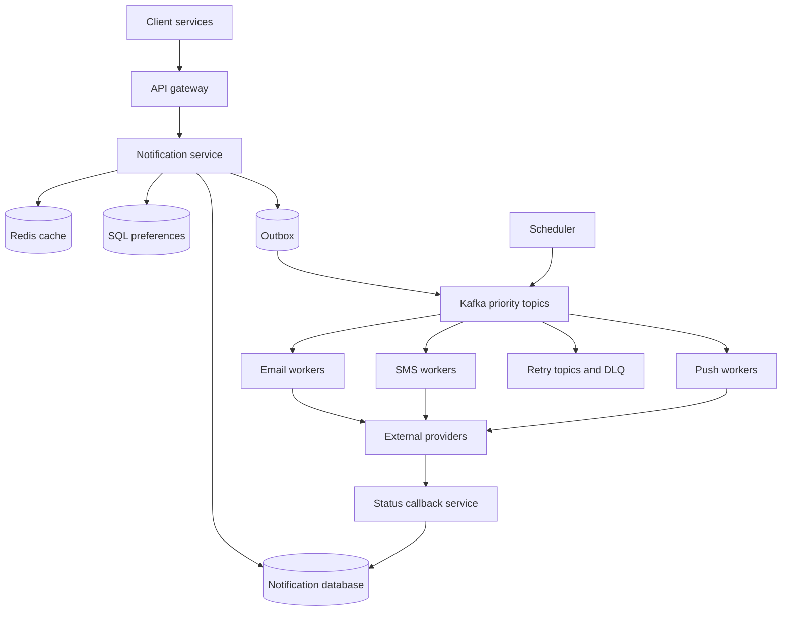

# Mock 03 — Notification System — Attempt 01

- **Date:** 2026-09-25
- **Type:** High-level design
- **Evaluator:** ChatGPT
- **Result:** 37/50 — 7.4/10
- **Verdict:** Lean Hire
- **Re-attempt:** 2026-10-05
- **Rule:** The original attempt is preserved separately from corrections.

## Problem

Design a notification platform that sends email, SMS, and mobile push notifications for services such as orders, payments, delivery, and marketing.

## My actual interview answers

### Q1 — Functional requirements

I proposed:

- Send email, SMS, and push notifications.
- Allow users to opt in or opt out by channel.
- Support scheduled notifications.
- Record delivery status for analytics and auditing.
- Payment and order notifications have the highest priority.
- Marketing and delivery notifications have lower priority.
- Users can mute marketing, choose frequency limits, and configure quiet hours.
- Encryption of notification messages and acknowledgement from the end user were declared out of scope.

### Q2 — Non-functional requirements

I proposed:

- The system should be highly scalable and highly available.
- OTP notifications should have low latency.
- The design should allow new channels to be added later.
- Availability target: 99.999%.
- OTP and payment notifications should arrive in milliseconds; marketing may take seconds.
- Use at-least-once delivery because exactly-once delivery would increase cost.
- Preserve ordering for order-status notifications.
- Retain notification history for months or years, depending on requirements and capacity.
- Retry when a provider fails and use another available provider instead of dropping the notification.

### Q3 — Traffic and storage

Assumptions supplied by the interviewer:

- 100 million daily active users.
- Five notifications per user per day.
- Peak traffic is five times average.
- Each stored notification record is 1 KB.
- Retention is one year.

My calculation:

- Notifications per day: 100 million × 5 = 500 million.
- Average rate: 500 million / 86,400 = about 5,787 notifications per second.
- Peak rate: 5,787 × 5 = about 28,935 notifications per second.
- Storage per day: about 500 GB.
- Storage per year: about 182 TB.
- I classified the platform as write-heavy because notifications and delivery events are continuously persisted.

### Q4 — APIs

I designed:

- POST /api/notification/send for immediate notifications.
- POST /api/notification/scheduled for scheduled notifications.
- GET /api/notification/{notificationId} for delivery status.
- PUT /api/user/{userId}/preferences for preference changes.
- The client sends an Idempotency-Key header.
- The API returns immediately and delivery continues asynchronously.
- Immediate requests return 202 Accepted.
- Scheduled notification creation returns 201 Created.

The request included user ID, channels, message, notification type, and preferences. The scheduled request also included scheduledFor.

### Q5 — Storage and entities

I selected:

- NoSQL for notification records because the workload is write-heavy, notification data varies, and horizontal scaling is required.
- SQL for user preferences because the structure is stable and relational.
- Redis for idempotency keys with a TTL.
- A cron-style scheduler that queries scheduled records using time and status indexes.
- Separate notification intent from delivery attempts because one notification can use several channels and each channel can retry.

Proposed records:

- Notification: notificationId, userId, message, priority, createdAt.
- DeliveryAttempt: attemptId, notificationId, channel, attemptNumber, error, executedAt.
- UserPreference: userId, preferences, timezone, updatedAt, quietHours, chosenChannel.

### Q6 — Architecture and request flow

Components I proposed:

- API Service for authentication, ingestion, and idempotency.
- Kafka or RabbitMQ to decouple request ingestion from delivery.
- Independent email, SMS, and push worker services.
- Redis for idempotency, locks, and cached preferences.
- SQL and NoSQL stores for preferences, audit records, and delivery logs.
- Separate high-priority and marketing queues.
- A scheduler that claims due records and sends them into the normal broker pipeline.
- Retry queues with delays such as one, five, and fifteen minutes.
- A DLQ after the maximum number of attempts.

My flow was:

1. Receive POST /api/notifications/send with an Idempotency-Key.
2. Run Redis SETNX with a 24-hour TTL.
3. Load preferences from Redis, falling back to SQL.
4. Publish the sanitized notification to the correct broker topic.
5. A channel worker calls its provider over HTTPS.
6. Store notification data in NoSQL.
7. Failed attempts move through delayed retry queues.
8. Permanently failed messages move to a DLQ and alert support.

## Architecture I drew

The submitted diagram showed:

- Client to API Gateway.
- Authentication and rate limiting at the gateway.
- Notification Service.
- Redis for idempotency and preference caching.
- SQL for user preferences.
- A message broker split by high-priority and marketing traffic.
- Separate email, SMS, and push workers.
- An event-driven path into a NoSQL analytics store.

## Scorecard

| Area | Score | Evidence |
|---|---:|---|
| Requirements | 7.5/10 | Good channels, preferences, scheduling, audit, priority and quiet-hours coverage. Some requirements remained vague or were classified incorrectly. |
| Architecture | 7.5/10 | Strong asynchronous backbone, isolated workers, priority queues, retries and DLQ. Durable write ordering and status callbacks were missing. |
| Problem-solving | 7/10 | Correct calculations, idempotency awareness, independent scaling and sensible retry flow. API-level and delivery-level duplicates were not fully solved. |
| Scale and trade-offs | 7/10 | Good throughput estimate and queue isolation. Provider limits, partitions, backpressure, multi-region and scheduler scale needed deeper treatment. |
| Communication | 8/10 | The answer was structured, understandable and supported by a useful diagram. A few claims needed more precise wording. |
| **Total** | **37/50** | **7.4/10 — Lean Hire** |

This is the strongest score so far:

| Mock | Score |
|---|---:|
| URL shortener | 34/50 |
| Rate limiter | 36/50 |
| Notification system | 37/50 |

## What went well

- The capacity calculation was correct and used proper units.
- The API correctly returned before external delivery completed.
- You identified at-least-once delivery as the practical internal guarantee.
- You separated notification intent from channel delivery attempts.
- You isolated urgent and marketing traffic using separate queues and workers.
- You gave each channel its own stateless worker fleet.
- You included delayed retries, a maximum attempt count, a DLQ, and operational alerts.
- The diagram clearly showed the main request path and data stores.

## Corrections to make during the interview

### 1. Use measurable but realistic SLOs

Saying 99.999% for the complete notification flow is difficult because external SMS, email, and push providers are outside our control.

A clearer answer is:

- Notification API availability: 99.99%.
- Accepted request persistence: 99.99%.
- OTP enqueue latency: p99 below 100 ms.
- OTP provider submission: p99 below 1 second.
- OTP end-to-end target: normally below 3–5 seconds.
- Marketing delivery: minutes may be acceptable.

We can measure our own service separately from provider delivery.

### 2. Do not promise millisecond OTP delivery

Our service can accept and enqueue an OTP in milliseconds. The mobile network and external provider can take seconds. State separate latency targets for API acceptance, provider submission, and actual delivery.

### 3. At-least-once does not mean duplicates are harmless

At-least-once means retries can create duplicates. We should still reduce them:

- Give every notification and channel delivery a stable delivery ID.
- Make consumers idempotent.
- Store a unique constraint on notificationId plus channel.
- Pass a provider idempotency key when supported.
- Check status before retrying an uncertain timeout.

Exactly-once delivery cannot be guaranteed end to end when third-party providers are involved.

### 4. Ordering should be scoped

Global ordering is unnecessary and would limit scale. Preserve order only where the business needs it, such as one order or one user conversation.

With Kafka, use orderId or aggregateId as the partition key. All events for that order reach the same partition. Add a sequence number so a consumer can detect old or missing events.

### 5. Make retention explicit

A good interview assumption is:

- Keep recent delivery data in the primary database for 30–90 days.
- Archive older audit data to object storage for one to seven years when compliance requires it.
- Delete or anonymize personal data according to policy.

### 6. Provider failover must preserve the channel

If the primary SMS provider fails, first switch to another SMS provider. Do not automatically change SMS to email or push unless the product has explicitly configured that fallback and the user has consented to that channel.

### 7. Do not put preferences in the send request

The server should load authoritative preferences. If the caller sends preferences, it could bypass opt-out rules.

The send request should contain:

- recipient or user ID
- notification type
- template ID and template variables
- requested channels
- priority
- business event ID
- scheduled time when required

### 8. Return the original result for duplicate API calls

For the same idempotency key and the same request body, return the original notification ID and status. A 409 response is better reserved for the same key being reused with a different request body.

### 9. Redis alone is not a safe idempotency record

A failure can happen after SETNX but before the notification is stored. The retry would then be rejected even though no notification exists.

Use a durable idempotency record with a unique key, request hash, notification ID, response, and expiry. Redis can cache the result, but it should not be the only source of truth for important notifications.

### 10. Persist before publishing

The original flow published to the broker before saving the notification. This creates a dual-write problem.

Use a transactional outbox:

1. In one database transaction, save the notification and an outbox event.
2. Return 202 Accepted after the transaction commits.
3. An outbox publisher sends the event to Kafka.
4. Mark the outbox event as published.
5. If the publisher crashes, it retries safely.

This avoids losing a notification between the database and Kafka.

### 11. Explain the NoSQL choice using access patterns

Write-heavy traffic and flexible schema do not automatically rule out SQL.

A better justification is:

- Main access patterns are lookup by notification ID, recent notifications by user, and due scheduled records.
- Records are append-heavy.
- No cross-record joins are required for the delivery path.
- Partition by a distributed key such as hash(userId), tenantId, or notificationId.
- Use separate indexes or tables for status and schedule queries.

SQL remains a valid choice when transactions, outbox, and relational queries are more important. A practical design can use SQL for the notification plus outbox transaction and move high-volume history to NoSQL or object storage.

### 12. A single cron scan will not scale

For hundreds of millions of records:

- Bucket scheduled notifications by execution minute or hour.
- Shard buckets across scheduler workers.
- Claim a record using a conditional update or lease.
- Enqueue it to the normal delivery topic.
- Run a recovery scan for expired leases.
- Make enqueueing and workers idempotent.

### 13. Retry only retryable errors

Retry timeouts, HTTP 429, and temporary 5xx errors. Do not retry permanent errors such as an invalid email address or invalid phone number.

Use exponential backoff with jitter, honor the provider Retry-After value, and apply a circuit breaker when a provider is unhealthy.

### 14. Add provider status callbacks

A successful provider request normally means accepted by provider, not delivered to the user.

Store separate states:

- ACCEPTED
- QUEUED
- SENT_TO_PROVIDER
- DELIVERED
- BOUNCED or REJECTED
- FAILED
- SUPPRESSED

A callback service receives provider webhooks and updates the final delivery status. Push delivery may confirm acceptance by the push platform, not that the user opened the message.

### 15. Treat encryption and personal data as baseline concerns

Even when message encryption is not the interview focus, use TLS in transit and encryption at rest. Mask phone numbers and email addresses in logs, restrict access, and avoid placing sensitive OTP values in long-retention analytics.

## Corrected API

### Create an immediate or scheduled notification

POST /v1/notifications

Headers:

- Idempotency-Key: stable key generated by the caller.

Important request fields:

- userId
- notificationType
- templateId
- templateVariables
- requestedChannels
- priority
- businessEventId
- scheduledAt, optional

Response:

- 202 Accepted for an accepted asynchronous request.
- Return notificationId, status, and statusUrl.
- A repeated identical request returns the same response.
- Reusing the key for a different payload returns 409 Conflict.

### Get status

GET /v1/notifications/{notificationId}

Return the overall state and one state per channel.

### Update preferences

PUT /v1/users/{userId}/notification-preferences

The preference service validates channel consent, categories, frequency caps, timezone, and quiet hours.

### Cancel a scheduled notification

DELETE /v1/notifications/{notificationId}

Cancellation succeeds only before the scheduler claims or dispatches the record.

## Corrected data model

### Notification

- notificationId
- tenantId
- userId
- businessEventId
- idempotencyKey
- requestHash
- notificationType
- templateId and templateVersion
- templateVariables
- priority
- requestedChannels
- status
- scheduledAt
- createdAt
- expiresAt

### Delivery

One record per notification and channel:

- deliveryId
- notificationId
- channel
- destination reference
- status
- provider
- providerMessageId
- attemptCount
- nextAttemptAt
- lastErrorCode
- createdAt
- updatedAt

Use a unique key on notificationId plus channel.

### DeliveryAttempt

Append one record for every try:

- attemptId
- deliveryId
- attemptNumber
- provider
- startedAt
- finishedAt
- responseCode
- retryable
- errorCode
- latencyMs

### UserPreference

- userId
- category
- enabledChannels
- consentVersion
- timezone
- quietHours
- frequencyLimit
- updatedAt

A useful key is userId plus category.

## Corrected architecture

### Component responsibilities

- **API Gateway:** authentication, authorization, coarse rate limiting and request size limits.
- **Notification Service:** validates requests, applies idempotency, resolves templates and preferences, and writes notification plus outbox.
- **Preference Service:** owns consent, channel settings, quiet hours and frequency caps.
- **Outbox Publisher:** safely transfers committed events from the database to Kafka.
- **Kafka:** absorbs bursts, preserves scoped ordering and decouples channel workers.
- **Scheduler:** claims due notifications and publishes them through the same delivery path.
- **Channel workers:** enforce provider limits, format payloads and call provider adapters.
- **Provider adapter:** hides vendor-specific request and response formats.
- **Callback Service:** receives delivery receipts and updates final state.
- **Retry topics:** delay temporary failures without blocking fresh traffic.
- **DLQ:** retains messages requiring investigation or controlled replay.
- **Metrics pipeline:** records latency, success rate, retries, provider health and queue lag.

## Correct immediate request flow

1. The client sends a request with an idempotency key.
2. The gateway authenticates and rate-limits the caller.
3. The Notification Service validates the request and calculates a request hash.
4. It checks the durable idempotency record.
5. It reads authoritative preferences, using Redis only as a cache.
6. It applies consent, quiet hours, frequency caps and priority rules.
7. In one transaction it saves the notification, channel deliveries, idempotency result and outbox event.
8. It returns 202 Accepted with the notification ID.
9. The outbox publisher sends the event to the correct priority Kafka topic.
10. Channel consumers process the event idempotently.
11. A provider adapter selects a healthy provider and sends the request.
12. The worker records the attempt and updates status.
13. Provider callbacks later update delivered, bounced or rejected status.
14. Temporary failures go to retry topics; exhausted failures go to the DLQ.

## Missing interview questions and simple answers

### 1. Why Kafka instead of RabbitMQ?

Kafka is a good fit for very high throughput, replay, consumer groups and ordering within a partition. RabbitMQ is strong for flexible routing and traditional work queues. I would choose Kafka here because bursts, replay and high-volume event history are important.

### 2. How do you prevent losing an event between the database and Kafka?

Use the transactional outbox pattern. Save the notification and outbox row in one database transaction. A separate publisher sends the outbox event to Kafka and retries until it succeeds.

### 3. How do you prevent duplicate notifications?

Use a durable API idempotency key, a stable delivery ID, idempotent consumers, a unique notification-and-channel record, and provider idempotency keys where supported. At-least-once remains the delivery model.

### 4. How do you preserve order?

Use the business entity, such as orderId, as the Kafka partition key. Events for one order stay in one partition. Add sequence numbers and ignore older events.

### 5. Can Kafka provide global ordering?

Only inside one partition. Global ordering would require one partition and would reduce throughput. The system should require ordering only per order, user, or conversation.

### 6. How do you stop marketing traffic from delaying OTPs?

Use separate topics, partitions, quotas and worker pools. Reserve capacity for OTP traffic and never let marketing consumers share the OTP worker pool.

### 7. Can low-priority traffic starve forever?

Apply quotas or weighted scheduling. For example, reserve most urgent capacity for OTPs while guaranteeing a small amount of processing capacity for normal traffic.

### 8. How do you handle a flash sale sent to millions of users?

Create a campaign job, split the audience into batches, produce notification tasks gradually, control the send rate based on provider quotas, and apply backpressure. Do not create millions of synchronous API calls.

### 9. How do you scale scheduled notifications?

Store records in time buckets, shard the buckets, and let several scheduler workers claim due items using leases or conditional writes. Expired leases are recovered.

### 10. What if the scheduler crashes after claiming a notification?

The claim has an expiry time. Another worker can reclaim it after the lease expires. Publishing and consumption remain idempotent.

### 11. How are provider rate limits handled?

Each provider adapter uses a token bucket or similar limiter. When the provider returns 429, honor Retry-After and place the event into a delayed retry path.

### 12. When should the system switch providers?

Switch on repeated timeouts, temporary 5xx failures, circuit-breaker opening, or exhausted capacity. Do not switch for permanent recipient errors.

### 13. What happens if Kafka is unavailable?

The API still commits the notification and outbox record. The outbox publisher waits and retries. Apply admission control if the backlog exceeds a safe limit.

### 14. What happens if Redis is unavailable?

Read preferences and durable idempotency records from their databases. Latency will increase, so use short timeouts and circuit breakers. Redis loss must not lose an accepted notification.

### 15. How are quiet hours calculated?

Store the user's timezone and local quiet-hour range. Convert the intended send time carefully, including daylight-saving changes. Urgent transactional messages may follow a separate business rule.

### 16. How are frequency limits enforced?

Maintain counters per user and notification category for defined windows. Check them before dispatch. Transactional notifications and legally required messages use separate rules.

### 17. How do templates work?

Store versioned templates by notification type, channel, language and tenant. Save the template version used so an old notification can be audited later.

### 18. How do you add WhatsApp later?

Add a new channel adapter, worker group, topic, preference option, templates and provider configuration. The Notification Service continues publishing the same channel-neutral delivery event.

### 19. How do you support multiple regions?

Accept traffic in more than one region, keep a user or tenant's ordering-sensitive events in a home region, replicate durable data, and define failover behavior. Avoid active-active processing of the same delivery unless idempotency is global.

### 20. Which metrics matter?

Track accepted requests, enqueue latency, queue lag, delivery latency by channel, provider success rate, retry rate, DLQ depth, duplicate suppression, scheduler delay, preference suppression and cost per successful delivery.

### 21. How do you replay a DLQ safely?

Fix the cause, select only eligible records, replay them with the same stable delivery IDs, and let idempotency checks prevent already completed deliveries from being sent again.

### 22. How do you protect sensitive data?

Use TLS, encryption at rest, secrets management, access controls and audit logs. Mask contact details in logs and keep OTP content out of analytics.

### 23. How do you cancel a scheduled notification?

Mark it CANCELLED using a conditional update. The scheduler checks status when claiming it. If it was already dispatched, cancellation may be too late.

### 24. How do you distinguish accepted from delivered?

The API status ACCEPTED means our system stored the request. SENT_TO_PROVIDER means the provider accepted it. DELIVERED is set only when a provider receipt supports that claim.

### 25. How do you test this design?

Run load tests at peak and burst traffic, provider timeout tests, Kafka and database failure tests, duplicate-event tests, retry/DLQ tests, scheduler crash tests, preference and quiet-hour tests, and multi-region failover tests.

## Two-minute interview answer

I would build the system as an asynchronous, event-driven platform. The client sends an idempotent request to the Notification Service. The service validates the request, loads user preferences, applies quiet hours and frequency limits, and stores the notification with an outbox event in one database transaction. It returns 202 Accepted without waiting for an external provider.

The outbox publisher sends the event to Kafka. I use separate topics and worker pools for urgent transactional traffic and bulk marketing traffic, so a campaign cannot delay OTPs. Email, SMS and push workers scale independently and use provider adapters, rate limits, timeouts and circuit breakers.

The system provides at-least-once internal delivery. Consumers are idempotent because exactly-once delivery cannot be guaranteed through third-party providers. Temporary failures use exponential backoff with jitter. Permanent failures are recorded immediately, and exhausted retries move to a DLQ.

Scheduled notifications are stored in time buckets and claimed by distributed scheduler workers using leases. Delivery status is updated from worker results and provider callbacks. I monitor queue lag, end-to-end latency, provider health, retries and DLQ depth.

## Top three gaps and corrective exercises

| Gap | Exercise | Due date | Verified? |
|---|---|---|---|
| Database and Kafka dual-write safety was missing | Explain transactional outbox and its crash cases in five minutes | 2026-09-28 | No |
| API idempotency was confused with end-to-end delivery deduplication | Design durable request idempotency plus idempotent channel workers | 2026-09-29 | No |
| Provider backpressure, callbacks and measurable SLOs were incomplete | Explain provider limiter, retry classification, status webhook and three latency SLOs | 2026-10-01 | No |

## Re-attempt plan

Re-attempt this design on **2026-10-05** without notes.

The second attempt should specifically answer:

1. How does the transactional outbox close the database-and-Kafka failure gap?
2. How are duplicate sends prevented after consumer or provider timeouts?
3. How are provider quotas, circuit breakers and retryable errors handled?
4. How does the distributed scheduler avoid double dispatch?
5. Which SLOs and alerts prove that OTP delivery is healthy?
