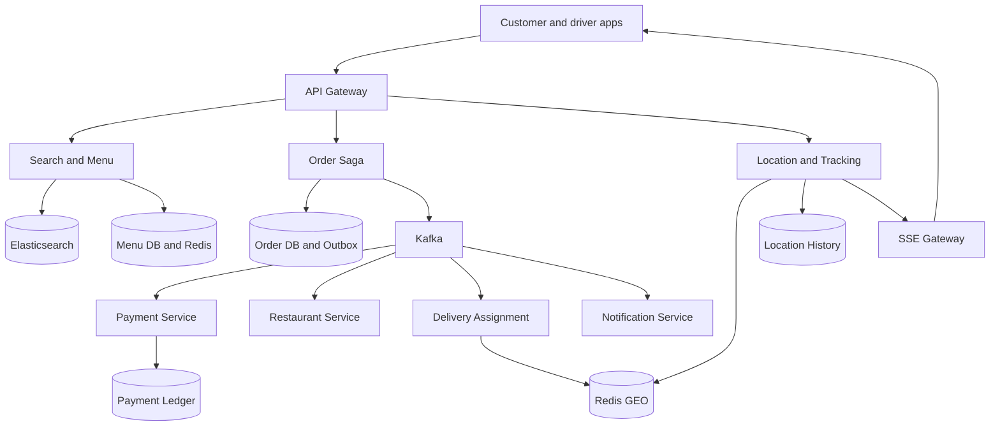

# Mock 04 — Food Delivery System — Attempt 01

- **Date:** 2026-10-01
- **Type:** High-level design
- **Evaluator:** ChatGPT
- **Score:** 39/50 — 7.8/10
- **Verdict:** Lean Hire, close to Hire
- **Re-attempt:** 2026-10-11
- **Important:** The failure-handling question was not attempted. Its model answer is included later but is not counted in the score.

## Problem

Design a food-delivery system similar to Swiggy, Zomato, or DoorDash. Customers discover restaurants, place orders, pay, receive status updates, and track delivery partners. Restaurants accept and prepare orders, while the platform assigns delivery partners.

## My actual interview answers

### Q1 — Functional requirements

I proposed:

- User registration.
- Search restaurants using customer location.
- Search by restaurant name and menu item.
- Add menu items to a cart and pay to confirm an order.
- Ask the restaurant to accept the order.
- Find a nearby delivery partner after restaurant acceptance.
- Show near-real-time delivery-partner location.
- Notify customers at each order stage.
- Show past orders in the customer profile.
- Support scheduled orders, cancellations, live tracking, and cash or online payments.
- Support a single restaurant per order.
- Keep subscriptions and multi-restaurant orders out of scope.

Actors:

- Customer
- Restaurant
- Delivery partner

Order states:

- ORDER_CREATED
- ORDER_PENDING
- ORDER_CONFIRMED
- ORDER_PREPARING
- ORDER_PICKUP
- ORDER_IN_ROUTE
- ORDER_DELIVERED
- CANCELLED
- REFUND

Cancellation rules:

- Full refund before restaurant acceptance.
- Possible cancellation charge after preparation starts.
- No cancellation after preparation completes and a partner is assigned.

Restaurant rejection:

- Suggest an alternative restaurant where possible.
- Otherwise refund the payment.

No delivery partner:

- Continue searching and notify the customer.
- Offer customer pickup with a discount.
- If delivery remains impossible, cancel, refund, and provide a coupon.

### Q2 — Non-functional requirements

I proposed:

- 99.999% availability.
- Restaurant search below 500 ms.
- Order placement below two seconds.
- Driver location update every 10–20 seconds.
- One-to-two-minute acceptable location delay.
- One million daily active users.
- Peak order estimate between 100,000 and 500,000 per hour.
- Strong consistency for menu price, order status, and payment status.
- Eventual consistency for delivery assignment.
- Exactly-once delivery for order events.
- Graceful degradation when dependencies fail.
- Payment retry with exponential backoff or alternate payment options.
- Serve cached menus when the Restaurant Service is down.
- Keep an order pending when restaurant confirmation is unavailable.
- Allow food preparation while delivery assignment is temporarily unavailable.

### Q3 — Traffic and storage

Given:

- One million daily active users.
- Ten searches per user per day.
- 200,000 orders per day.
- Ten-times peak traffic.
- 100,000 active deliveries at peak.
- One 500-byte location event every 15 seconds.
- Seven-day location retention.

My calculations:

- Average search traffic: about 115 requests per second.
- Peak search traffic: 575–1,150 requests per second.
- Average order traffic: about 2.32 orders per second.
- Peak order traffic: about 23 orders per second.
- Assumed eight peak hours with 100,000 active deliveries and sixteen normal hours with 10,000.
- Location storage: about 115.2 GB per day.
- Seven-day storage: about 806.4 GB.
- Search is read-heavy.
- Order and location processing are write-heavy.
- Location updates are the likely bottleneck.

I did not explicitly calculate peak location-event throughput.

### Q4 — APIs

I designed:

- GET /api/v1/restaurants/search with latitude, longitude, and radius.
- GET /api/v1/restaurants/{restaurantId}/menu.
- POST /api/v1/orders.
- POST /api/v1/payments/charge.
- PATCH /api/v1/restaurants/orders/{orderId}/status.
- POST /api/v1/delivery/assignments/{assignmentId}/accept.
- POST /api/v1/delivery/location.
- GET /api/v1/orders/{orderId}/track.
- POST /api/v1/orders/{orderId}/cancel.

For order creation:

- Request contains an idempotency key, restaurant ID, items, customizations, address, and expected total.
- Backend loads source-of-truth item prices.
- It recalculates subtotal, tax, delivery fees, and promotions.
- A price mismatch returns 409 Conflict with the latest total.
- Payment is asynchronous.
- Order begins as CREATED or PENDING_PAYMENT.
- After payment it becomes PAID or PENDING_ACCEPTANCE.
- Duplicate order creation is prevented using an idempotency key.
- SSE is used for customer tracking because updates flow mainly from server to customer.

### Q5 — Data stores and model

I selected:

- PostgreSQL for users and addresses.
- PostgreSQL plus Redis for restaurants and menus.
- Elasticsearch for restaurant and menu search.
- PostgreSQL for orders.
- A document database as an option for order-item snapshots.
- PostgreSQL for payments and refunds.
- Cassandra for historical location events.
- PostgreSQL or Redis with TTL for cart data.

Order fields included:

- orderId
- userId
- restaurantId
- status
- totalAmount
- taxAmount
- deliveryFee
- deliveryAddressSnapshot
- idempotencyKey
- createdAt and updatedAt

OrderItem fields included:

- orderItemId
- orderId
- itemId
- snapshotName
- snapshotPrice
- quantity
- customizations

Payment fields included:

- paymentId
- orderId
- transactionReference
- paymentMethod
- amount
- status
- completedAt

DeliveryAssignment fields included:

- assignmentId
- orderId
- partnerId
- status
- offeredAt, acceptedAt, completedAt
- version for optimistic locking

I proposed indexes on userId, restaurantId, and status. I stored price and name snapshots so later menu changes do not modify historical orders. Optimistic locking and database constraints prevent two partners from claiming one assignment. A finite-state machine prevents invalid order transitions.

### Q6 — Architecture and order flow

I designed these components:

- API Gateway
- User Service
- Menu Service
- Search Service
- Cart Service
- Order Service acting as Saga Orchestrator
- Payment Service
- Restaurant Order Service
- Delivery Assignment Service
- Location Service
- Notification Service
- Kafka or RabbitMQ
- PostgreSQL, Redis, Elasticsearch, and Cassandra

Order flow:

1. Client calls the API Gateway with authentication, order data, and an idempotency key.
2. Gateway authenticates and rate-limits the call.
3. Order Service uses a Redis-backed five-minute lock for duplicate protection.
4. Order Service synchronously validates menu availability and price.
5. It writes the order as CREATED.
6. It sends a payment command and starts the Saga.
7. Payment Service calls the provider, updates its ledger, and publishes PAYMENT_SUCCESSFUL.
8. Restaurant Service notifies the kitchen.
9. Restaurant acceptance publishes ORDER_ACCEPTED.
10. Order Service changes the order to PREPARING.
11. Delivery Assignment searches Redis GEO for nearby online partners.
12. Optimistic locking allows only one partner to claim the assignment.
13. Partner location is written to Redis and appended through Kafka for history.
14. Customer tracking uses SSE.
15. Transactional outbox is used for reliable database-to-broker publishing.
16. If the restaurant rejects after payment, the Saga marks the order CANCELLING, refunds or voids payment, notifies the user, and may issue a voucher.
17. Delivery matching begins after restaurant acceptance.

### Q7 — Failure handling

This question was not attempted because the mock was stopped. The completed answer appears later and is not included in the score.

## Architecture from the submitted diagram

The diagram correctly showed:

- Customer and driver clients.
- API Gateway.
- User, Menu, Search, and Location services.
- PostgreSQL, Redis, Elasticsearch, and Cassandra.
- Cart, Order, Payment, and Notification services.
- Order Service as Saga Orchestrator.
- Message broker.
- Restaurant Order and Delivery Assignment services.

The diagram was readable and matched the verbal flow. The relationship between Search, Cassandra history, and the transactional services could be drawn more clearly.

## Scorecard

| Area | Score | Evidence |
|---|---:|---|
| Requirements | 8/10 | Strong customer, restaurant, partner, tracking, cancellation, rejection and no-driver coverage. Some product policies were assumed without clarification. |
| Architecture | 8.5/10 | Good service boundaries, Saga orchestration, outbox, search, geo lookup, SSE, and channel-specific storage. |
| Problem-solving | 7.5/10 | Good price validation, order snapshots, optimistic locking and compensation. Durable idempotency and payment uncertainty needed deeper treatment. |
| Scale and trade-offs | 7/10 | Correct search, order and storage estimates; location throughput was omitted and the reliability deep dive was stopped. |
| Communication | 8/10 | Clear, structured flow and a useful diagram. Some guarantees and latency targets needed more precise language. |
| **Total** | **39/50** | **7.8/10 — Lean Hire, close to Hire** |

## Progress across mocks

| Mock | Score |
|---|---:|
| URL shortener | 34/50 |
| Rate limiter | 36/50 |
| Notification system | 37/50 |
| Food delivery | 39/50 |

## What went well

- Requirements covered all three actors and the full order lifecycle.
- Search, order, payment, dispatch, location, and notification were separated cleanly.
- Capacity calculations were mostly correct.
- APIs were realistic and included idempotency and price revalidation.
- SSE was a good choice for one-way customer tracking.
- Data stores were chosen according to access patterns.
- Order-item and address snapshots were correctly identified.
- Optimistic locking and a finite-state machine handled important concurrency rules.
- Saga orchestration and compensating refund actions were explained clearly.
- Transactional outbox correctly addressed database-to-broker dual writes.
- The diagram matched the explanation.

## Corrections and improvements

### 1. Five-nines availability is too broad

Do not promise 99.999% for the complete order journey when payment gateways, restaurants, and mobile networks are external dependencies.

A clearer split is:

- Restaurant browsing: 99.99%.
- Order acceptance API: 99.99%.
- Payment and order state: prioritize correctness and durable recovery.
- Live tracking: may degrade without blocking the order.

### 2. Location delay should be smaller

With updates every 15 seconds, a one-to-two-minute delay does not feel real-time. A better target is:

- Location update interval: 10–15 seconds.
- Tracking propagation: p95 below five seconds.
- Stale warning after 30–45 seconds.
- Last-known position remains visible during temporary failure.

### 3. Do not promise exactly-once events

Kafka and distributed consumers normally provide at-least-once processing. Exactly-once end-to-end cannot be guaranteed across databases, payment gateways, restaurants, and devices.

Use:

- at-least-once delivery
- idempotent consumers
- unique business keys
- inbox and outbox tables
- conditional state transitions
- reconciliation jobs

This provides effectively-once business outcomes.

### 4. Correct peak location throughput

100,000 active partners updating every 15 seconds produce:

- 100,000 / 15 = about 6,667 location events per second.
- At 500 bytes each, raw ingress is about 3.33 MB per second before protocol, replication, and index overhead.

Your storage result of about 115.2 GB per day and 806.4 GB per week was correct under your peak-and-normal-hour assumptions. The “480 MB × 7” line was only a writing mistake.

### 5. Menu reads can be eventual, checkout must be authoritative

Restaurant browsing can use Redis and Elasticsearch with slightly stale data. Checkout must revalidate item availability and current price against an authoritative Menu Service. Order, payment, and partner assignment require stronger conditional updates.

### 6. Do not use a short Redis lock as the idempotency source

A five-minute lock prevents simultaneous clicks but does not safely support retries after a crash.

Persist:

- caller or user ID
- idempotency key
- request hash
- order ID
- stored response
- expiry

Use a unique database constraint. Redis may accelerate lookup but should not be the source of truth.

### 7. Prefer authorization before payment capture

A safer payment flow is:

1. Create payment intent or authorize the amount.
2. Ask the restaurant to accept.
3. Capture payment after acceptance.
4. Void authorization when rejected or timed out.

This reduces refunds. If the business requires capture first, the Saga must perform an idempotent refund.

### 8. Keep OrderItem with the order transaction

Using a separate document database only for order-item snapshots adds another consistency boundary. A simpler design stores Order and OrderItem in PostgreSQL in one transaction. JSONB can store customizations.

Use another store only when measurements show a real scaling need.

### 9. Improve cart storage choice

Redis with TTL is suitable for an active cart because reads and writes are frequent and temporary. If cart recovery across long periods is required, asynchronously persist a durable copy.

### 10. Improve index design

Useful indexes include:

- Orders: userId plus createdAt descending.
- Orders: restaurantId plus status plus createdAt.
- Orders: status plus updatedAt for stuck-order recovery.
- Payments: unique provider plus providerTransactionId.
- Assignments: partnerId plus status.
- Scheduled orders: status plus scheduledAt.
- Location history: partition by deliveryId and day, cluster by event timestamp.

### 11. Add identifiers to location updates

The driver is authenticated, but the update still needs an assignment or delivery ID and a sequence number. Validate that the driver currently owns that assignment. Reject old or replayed updates.

### 12. Validate JWT at the gateway

The gateway can validate a signed JWT locally using cached public keys. It does not need to call User Service for every request. Call User Service only when fresh profile or account-state information is necessary.

### 13. Be careful when no driver is available

Starting food preparation without a delivery partner can reduce customer wait, but it can also produce cold food or waste. Use an estimated supply check before acceptance, start matching early, and apply a deadline. The policy can vary by restaurant preparation time and local driver supply.

## Corrected architecture

## Complete answer to Q7 — Failure handling and distributed correctness

### 1. Customer retries POST /orders after a timeout

Use durable idempotency, not only a Redis lock.

- Client sends the same idempotency key.
- Order database has a unique constraint on userId plus idempotencyKey.
- Store a hash of the request and the original response.
- Same key and same request returns the original order ID and status.
- Same key with a different request returns 409 Conflict.
- Payment has its own idempotency key based on the order ID.

This prevents a second order even if the first response was lost.

### 2. Payment succeeds but Payment Service crashes before updating its database

This is an uncertain payment outcome.

- Send a stable payment idempotency key to the gateway.
- Keep the payment record in PROCESSING.
- The gateway webhook later reports the result.
- A reconciliation job queries the provider using payment intent ID or idempotency key.
- Update the ledger using a unique provider transaction ID.
- Save the ledger update and outbox event in one database transaction.
- Do not blindly charge again after a timeout.

If the provider says the charge succeeded, continue the Saga. If it failed, mark payment failed. If still unknown, keep it pending and investigate automatically.

### 3. PAYMENT_SUCCESSFUL is consumed twice

Use an inbox or processed-event table.

- Every event has a unique eventId.
- Consumer inserts eventId with a unique constraint in the same transaction as its state update.
- If the event ID already exists, acknowledge it without repeating the action.
- State transition is conditional, such as PENDING_PAYMENT to PAID only.
- Refund and capture commands also use stable idempotency keys.

At-least-once messaging then produces one business outcome.

### 4. Restaurant does not respond within two minutes

Use a durable Saga timeout.

- Store acceptanceDeadline in Saga state.
- A timer or recovery worker finds expired orders.
- Optionally resend the restaurant notification once.
- Conditionally move PENDING_ACCEPTANCE to RESTAURANT_TIMEOUT.
- Void the payment authorization or issue an idempotent refund.
- Release any delivery reservation.
- Notify the customer and suggest alternatives.
- Reject a late restaurant acceptance because the expected state no longer matches.

### 5. Two delivery partners accept at the same time

Use a conditional database update with optimistic locking.

Conceptually:

- Update assignment to ACCEPTED with partnerId only where status is OFFERED and version is the expected value.
- Only one transaction updates one row.
- The winner receives success.
- The loser receives 409 Already Assigned.
- Add a unique rule ensuring one active assignment per order.
- A short offer lease stops stale offers from remaining claimable forever.

A distributed lock may reduce collisions, but the database constraint is the final correctness boundary.

### 6. Kafka events arrive out of order

Reduce out-of-order delivery and still defend against it.

- Use orderId as the Kafka partition key so one order normally stays ordered in one partition.
- Every order event carries orderVersion or sequenceNumber.
- The Order state machine checks the expected current state and version.
- Ignore duplicate or older versions.
- Delay or retry a future version when a predecessor is missing.
- Send unresolved events to a retry topic or DLQ.
- Run reconciliation against service databases.

ORDER_PREPARING must not apply while the order is still PENDING_PAYMENT. It waits until PAYMENT_SUCCESSFUL is applied or reconciliation resolves the mismatch.

### 7. Delivery partner accepts and later cancels or goes offline

Use heartbeats and an assignment lease.

- Driver app sends heartbeats.
- Mark partner unavailable when heartbeat TTL expires.
- If food is not picked up, reopen assignment and find another partner.
- Notify restaurant and customer about the delay.
- If food is already picked up, escalate to operations and find a controlled handoff or replacement.
- Keep assignment attempts in an audit table.
- Make reassignment commands idempotent.

### 8. Customer cancellation races with restaurant acceptance

Use one atomic order-state decision.

- Both commands include the order version.
- Cancellation conditionally updates only allowed states such as PENDING_PAYMENT or PENDING_ACCEPTANCE.
- Restaurant acceptance conditionally updates only PENDING_ACCEPTANCE.
- Only one update succeeds.
- The losing request reloads the current state and applies business policy.
- If cancellation wins, reject late acceptance and void or refund payment.
- If acceptance wins, cancellation follows the post-acceptance fee policy.
- Saga compensation commands are idempotent.

Do not allow two services to independently decide the final state.

### 9. Redis Location Service is unavailable

Live tracking should degrade without stopping delivery.

- Redis Cluster uses replicas and automatic failover.
- Location Service uses short timeouts and a circuit breaker.
- Continue accepting location events into Kafka when possible.
- Show the last known location with a stale indicator.
- Rebuild Redis current-location entries from the latest Kafka events after recovery.
- Fall back to a durable recent-location store only if the latency is acceptable.
- Order and payment flows remain available.

### 10. Saga Orchestrator crashes halfway through the order

Saga state must be durable.

- Persist sagaId, orderId, current step, status, version, deadlines, and completed compensations.
- Save Saga state changes and outgoing commands through a transactional outbox.
- Process incoming replies through an inbox for deduplication.
- Another Order Service instance can resume the Saga.
- A recovery worker scans stuck Sagas using status and updatedAt.
- Timeouts are stored durably, not only in memory.
- Compensation steps are idempotent.
- Optimistic locking prevents two orchestrator instances from advancing the same Saga simultaneously.

The Orchestrator can crash and restart without losing which steps completed.

## Additional likely interview questions

### Why use Saga orchestration instead of choreography?

The order journey has clear steps, deadlines, and compensations. A central orchestrator makes the flow easier to understand, audit, and recover. The trade-off is that the Order Service becomes important and must be highly available and durably store Saga state.

### How does Elasticsearch stay synchronized with menu data?

Menu Service writes its database and an outbox event in one transaction. An indexer consumes the event and updates Elasticsearch. Search is eventually consistent, but checkout validates against the Menu Service.

### How do you find nearby delivery partners?

Store available partners in Redis GEO with a heartbeat TTL. Search increasingly larger radiuses, rank by ETA and workload, and send time-limited offers. Redis is for fast candidate lookup; PostgreSQL stores the authoritative assignment.

### How do you prevent one driver receiving too many offers?

Track active offers and assignments per driver. Apply a limit, remove busy drivers from the available set, and rank candidates using current workload.

### How is ETA calculated?

Use restaurant preparation time, driver travel time to restaurant, pickup waiting time, route time to customer, traffic, weather, and historical data. Recalculate ETA when important events occur.

### How do you handle a flash-sale traffic spike?

Cache menus, protect checkout with rate limits, use queues to absorb asynchronous work, autoscale consumers using lag, reserve capacity for payments and orders, and apply backpressure before databases become overloaded.

### What happens if Elasticsearch is unavailable?

Allow direct access to known restaurants and recently cached results. Checkout remains available because it uses the authoritative Menu Service. Search may return a degraded response.

### How do you prevent overselling an unavailable item?

For ordinary food menus, revalidate at checkout and let the restaurant accept or reject. For scarce inventory, reserve quantity using an atomic conditional update with an expiry.

### How do you reconcile orders stuck in an intermediate state?

Run a recovery job using status and updatedAt indexes. It checks payment, restaurant, and assignment sources of truth, then advances or compensates the Saga idempotently.

### What should be monitored?

Track search latency, checkout success, payment uncertainty, restaurant acceptance time, assignment time, unassigned orders, location lag, Kafka lag, Saga age, refund failures, duplicate suppression, database errors, and end-to-end delivery time.

## Two-minute corrected interview summary

I would separate browsing, ordering, payment, restaurant handling, delivery assignment, location tracking, and notifications into independent services.

Browsing is read-heavy, so restaurant and menu data is cached in Redis and indexed in Elasticsearch. Search may be eventually consistent, but checkout always revalidates price and availability against the authoritative Menu Service.

Order Service owns a durable Saga. It creates the order idempotently, authorizes payment, waits for restaurant acceptance, captures payment, assigns a delivery partner, and coordinates compensation on failure. Each service owns its database and publishes events through a transactional outbox. Consumers use an inbox and conditional state transitions so at-least-once events do not create duplicate business actions.

Delivery Assignment uses Redis GEO for nearby candidates and PostgreSQL optimistic locking for the final claim. Drivers send location every 15 seconds. Redis stores the latest point, Kafka carries the stream, Cassandra stores short-term history, and SSE pushes updates to the customer.

The critical reliability mechanisms are durable idempotency, outbox and inbox, event versions, Saga timeouts, reconciliation jobs, payment webhooks, database constraints, and idempotent compensation.

## Top three gaps and corrective exercises

| Gap | Exercise | Due date | Verified? |
|---|---|---|---|
| Failure and race-condition deep dive was not attempted | Answer all ten Q7 scenarios without notes | 2026-10-04 | No |
| Exactly-once was promised instead of explaining effectively-once outcomes | Explain at-least-once plus inbox, state guards and reconciliation | 2026-10-05 | No |
| Redis lock was treated as durable order idempotency | Design a database idempotency record and three crash cases | 2026-10-06 | No |

## Re-attempt plan

Re-attempt the Food Delivery design on **2026-10-11**.

The second attempt should demonstrate:

1. Durable order and payment idempotency.
2. Payment webhook and reconciliation after uncertain outcomes.
3. Inbox/outbox and event-version handling.
4. Atomic cancellation versus restaurant acceptance.
5. Durable Saga recovery after an orchestrator crash.
