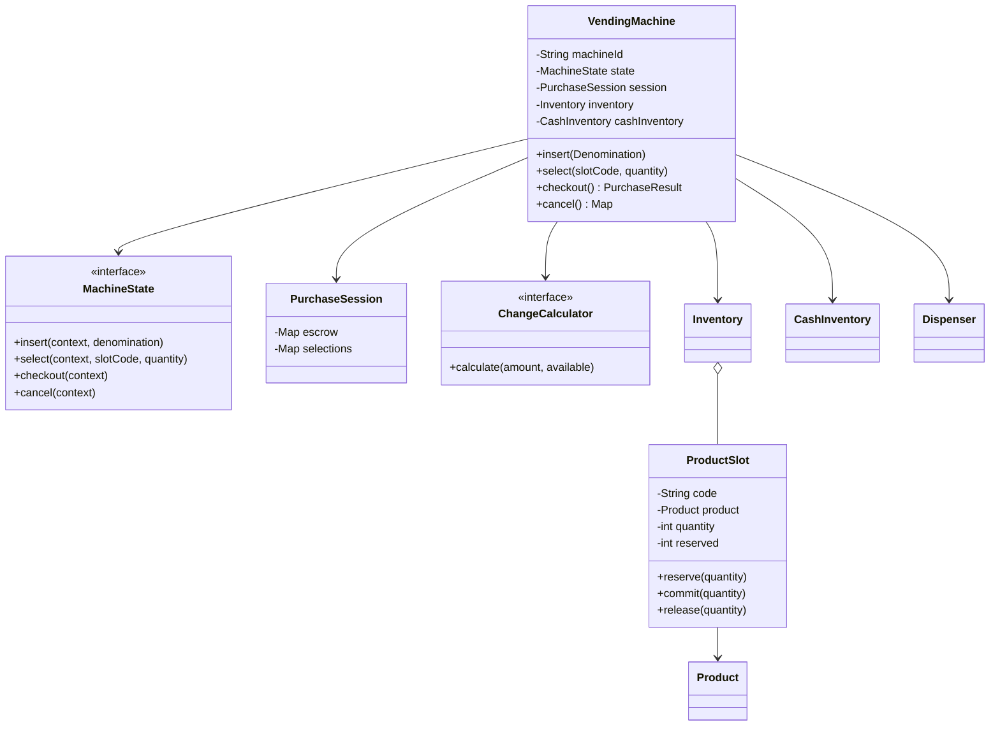
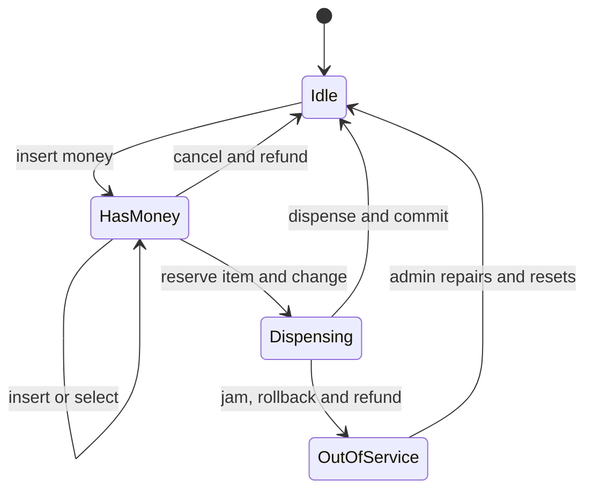

# Mock 05 — Vending Machine LLD — Attempt 01

- **Date:** 2026-10-02
- **Type:** Low-level design
- **Evaluator:** ChatGPT
- **Original score:** 29.5/50, recorded as 30/50 in the tracker
- **Verdict:** Borderline; class design started but coding was not attempted
- **Re-attempt:** 2026-10-12
- **Implementation added after the mock:** [VendingMachine.java](../../lld/vending-machine/VendingMachine.java)
- **Behavior tests added after the mock:** [VendingMachineTest.java](../../lld/vending-machine/VendingMachineTest.java)

The original answers and the corrected solution are kept separate. Code added after the interview does not increase the original score.

## Problem

Design a vending machine that displays products, accepts money, supports product selection, dispenses items, returns change, handles cancellation and failures, and allows an administrator to restock products.

## My actual interview answers

### Q1 — Requirements

I proposed these functional requirements:

- Accept coins and track the current balance.
- Display products and prices.
- Allow product selection.
- Dispense when balance is sufficient.
- Return change.
- Support cancellation and full refund.
- Handle out-of-stock products.
- Allow an administrator to restock products.

Non-functional requirements:

- Thread-safe operations.
- Clear state transitions.
- Extensible product types.
- Maintainable state management.

Scope:

- One currency.
- Coins and notes are supported.
- Card and UPI payments are out of scope.

Actors:

- Customer
- Administrator

Failure behavior:

- Out of stock: refund or allow another selection.
- Insufficient money: accept more money or cancel and refund.
- No exact change: cancel and refund or select another product.
- Cancellation: refund inserted money.
- Dispensing failure: wait five to ten minutes, then cancel and refund.
- Multiple products may be purchased if the inserted amount is sufficient.

States:

- Idle
- HasMoney
- SelectProduct
- Dispensing
- Optional OutOfStock state

I described valid and invalid operations for Idle, HasMoney, and Dispensing.

### Q2 — Class design

The submitted diagram contained:

- VendingMachine with currentState, inventory, currentBalance, selectedProduct, insert, select, dispense, refund, setState, and getBalance.
- State interface with insert, select, dispense, and refund.
- IdleState, HasMoneyState, and DispensingState.
- Inventory with product and quantity maps.
- Product with code, name, and price.
- Coin enum containing supported denominations.
- A note that inventory reduction and restocking should be synchronized.

I answered that VendingMachine should be a Singleton because more than one object would make state and inventory harder to maintain.

I selected the State pattern. Concrete states would implement valid operations and return an error for invalid operations.

I said money should use the smallest currency unit and supported denominations should be represented by an enum.

I described PurchaseSession as short-lived customer state containing active transaction data.

I proposed denomination counts for the internal cash vault.

I proposed a greedy algorithm for change.

I proposed a Dispenser abstraction that reports success or failure and allows rollback after a mechanical jam.

I correctly said State implementations should not receive unrestricted access to all private fields of VendingMachine.

### Q3 — Java implementation

The mock was stopped before Java code, transaction commit, rollback, and tests were attempted.

## Scorecard

| Area | Score | Evidence |
|---|---:|---|
| Requirements | 7.5/10 | Good purchase, refund, stock, admin, multiple-item and failure coverage. Some physical-machine behavior was unrealistic. |
| Class design | 6.5/10 | State, Inventory, Product and denominations were identified. Slot, session, cash inventory, change calculator and dispenser relationships were incomplete. |
| Problem-solving and code | 3/10 | Useful ideas were discussed, but no implementation or tests were attempted. |
| Concurrency and trade-offs | 5.5/10 | Thread safety was recognized, but operation boundaries, reservations, cash escrow and Singleton limitations were not handled. |
| Communication | 7/10 | The explanation and diagram were understandable and structured. |
| **Total** | **29.5/50** | **5.9/10 — Borderline** |

## My correct answers

These parts of the original answer were correct and should be kept:

- State pattern is a good fit because allowed operations depend on machine state.
- Invalid operations should fail clearly.
- Money should be stored in the smallest unit, such as paise.
- Supported coin and note values can be represented using an enum.
- PurchaseSession should hold temporary customer data.
- Cash inventory should count each denomination.
- Product selection must check stock and sufficient balance.
- Cancellation should return the inserted tender.
- The Dispenser should be an abstraction that reports success or mechanical failure.
- Inventory mutation and restocking need synchronization.
- State classes should use a narrow context instead of unrestricted internal access.
- Product and change must be reserved before attempting a purchase.
- Multiple products can be supported by keeping a cart-like selection map.

## Incorrect or incomplete answers and corrections

### 1. Singleton is not a domain requirement

The original answer said only one VendingMachine object should exist.

Correction:

- A company may own thousands of physical machines.
- Each machine should be represented by one aggregate identified by machineId.
- Singleton only guarantees one object inside one JVM or class loader.
- It does not protect multiple processes or represent several physical machines.
- Dependency injection may create one object for one local hardware controller, but the domain class should remain constructible and testable.

Interview answer:

“VendingMachine does not have to be a Singleton. I create one aggregate per physical machine ID. The application configuration may keep one instance for the local controller, but I do not hide construction behind a global Singleton because that makes testing and multi-machine support difficult.”

### 2. Product must not contain slot quantity

Product describes the item:

- product ID
- name
- price

ProductSlot describes physical placement:

- slot code
- product
- capacity
- current quantity
- reserved quantity

Inventory maps slotCode to ProductSlot.

The same product may appear in more than one slot.

### 3. Do not store current balance or price as double

Use long paise or a Money value object.

Example:

- ₹12 becomes 1,200 paise.
- ₹20 becomes 2,000 paise.

The added implementation uses a Money record with long paise and Currency.

### 4. Greedy change is not always safe

Greedy may fail with unusual denominations or limited physical inventory even when another exact combination exists.

Example:

- Change required: ₹6.
- Available: one ₹4 coin and two ₹3 coins.
- Greedy selects ₹4 and then fails.
- Correct answer is ₹3 + ₹3.

Use backtracking or bounded dynamic programming. The implementation includes an exact limited-inventory backtracking calculator.

### 5. Inserted money needs an escrow

Do not immediately add inserted cash to the permanent vault.

During the transaction:

- PurchaseSession holds the exact inserted denominations in escrow.
- Cancellation returns the same escrowed money.
- Successful dispensing deposits the escrow into cash inventory.
- If dispensing fails, escrow is refunded.

For a cash acceptor that cannot physically return the same note, the machine needs a documented hardware refund policy or digital refund mechanism.

### 6. Multiple items require selections, not selectedProduct

Replace one selectedProduct field with:

- Map of slotCode to quantity.
- Total is calculated from all selected slots.
- All required items must be reserved together.
- If any slot cannot be reserved, release earlier reservations.

### 7. Waiting five to ten minutes after a jam is not practical

A mechanical jam should:

- Stop accepting new money.
- Release software reservations when sensors confirm no item was dispensed.
- Refund the customer or record a refund claim.
- Move the machine to OUT_OF_SERVICE.
- Alert the administrator.

If sensors cannot confirm whether the item dropped, record an uncertain outcome for reconciliation rather than blindly decrementing or restoring inventory.

### 8. Synchronize the whole transaction boundary

Synchronizing only reduceQuantity and restock is not enough.

The following sequence must be protected as one operation:

1. Validate selections.
2. Calculate price.
3. Check balance.
4. Reserve all products.
5. Calculate and reserve exact change.
6. Dispense.
7. Commit inventory and cash.
8. Clear session.

The implementation uses one fair ReentrantLock around public machine operations. A physical machine normally serves one customer session at a time.

### 9. Keep State classes small

State objects decide whether an operation is allowed and delegate actual work through a narrow MachineContext interface.

They should not:

- manipulate inventory maps directly
- calculate change
- control hardware directly
- expose VendingMachine private fields

This keeps the State pattern from becoming a collection of large, tightly coupled classes.

## Corrected class design

## Corrected states

## Main responsibilities

### VendingMachine

- Entry point for customer and admin operations.
- Owns current state and current session.
- Serializes operations using a lock.
- Coordinates inventory, cash, change calculation, and dispenser.
- Does not act as a global Singleton.

### Product

Immutable description of an item.

### ProductSlot

Owns physical slot capacity, quantity, and reservations.

### Inventory

Finds slots, checks availability, reserves multiple items, commits or releases reservations, and supports restocking.

### PurchaseSession

Contains:

- inserted denominations in escrow
- selected slot quantities
- calculated inserted value

It is cleared after success, cancellation, or failure.

### CashInventory

Stores permanent counts of each denomination. It previews available change after a successful escrow deposit and commits cash changes only after dispensing succeeds.

### ChangeCalculator

Returns an exact set of denominations or reports that exact change is unavailable. It uses actual denomination counts.

### Dispenser

Hardware abstraction. It accepts a list of slot-and-quantity commands and returns success or a failure reason.

### MachineState

Controls valid operations. The implementation contains:

- IdleState
- HasMoneyState
- DispensingState
- OutOfServiceState

### MachineContext

Narrow interface used by states. It prevents State classes from accessing all VendingMachine fields.

## Successful ₹20 to ₹12 flow

1. Machine begins in IDLE.
2. Customer inserts ₹20.
3. PurchaseSession is created and keeps ₹20 in escrow.
4. State becomes HAS_MONEY.
5. Customer selects one product from A1 costing ₹12.
6. Inventory confirms A1 is available.
7. Checkout calculates ₹8 change.
8. Inventory reserves one A1 item.
9. ChangeCalculator finds exact ₹8 using available denominations.
10. State becomes DISPENSING.
11. Dispenser reports success.
12. Inventory commits the reserved item.
13. CashInventory deposits the ₹20 escrow.
14. CashInventory removes the ₹8 change.
15. Machine returns ₹8.
16. Session is cleared.
17. State returns to IDLE.

## Dispensing-failure flow

1. Products and change are planned.
2. Dispenser reports a jam.
3. Reserved products are released if sensors confirm nothing dropped.
4. Escrowed money is returned.
5. Permanent cash inventory is not changed.
6. Session is cleared.
7. Machine enters OUT_OF_SERVICE.
8. Administrator is alerted.
9. Repair and reconciliation are required before resetting to IDLE.

## Added Java implementation

The complete implementation is in [VendingMachine.java](../../lld/vending-machine/VendingMachine.java).

It includes:

- Money in paise.
- Denomination enum.
- Product and ProductSlot.
- Multi-item Inventory reservation.
- PurchaseSession escrow.
- CashInventory.
- Exact-change backtracking.
- Dispenser abstraction.
- Narrow MachineContext.
- State implementations.
- ReentrantLock transaction boundary.
- Commit and rollback behavior.
- Out-of-service transition after a jam.

## Added tests

The test file is [VendingMachineTest.java](../../lld/vending-machine/VendingMachineTest.java).

Test scenarios:

1. Insert ₹20, buy a ₹12 product, and receive exact ₹8 change.
2. Cancellation returns the exact inserted tender.
3. No exact change does not consume inventory.
4. Dispenser failure releases inventory, refunds money, and disables the machine.
5. Multiple products can be bought in one transaction.

The workspace contained a Java 17 runtime but no javac executable, so the files were statically reviewed but could not be compiled here. Run them locally with:

    javac -d out lld/vending-machine/VendingMachine.java lld/vending-machine/VendingMachineTest.java
    java -cp out lld.vendingmachine.VendingMachineTest

Expected output:

    All vending-machine tests passed

## Likely interview follow-up questions

### Why not use Singleton?

One application may manage many machines, and Singleton makes testing difficult. Use one aggregate per machine ID. Application wiring can control lifecycle.

### Why use State pattern?

The same operation has different behavior depending on state. State removes large conditional blocks and keeps allowed transitions explicit.

### Why not put all business logic inside states?

States should control allowed actions. Inventory, change calculation, and hardware logic belong to focused collaborators to follow single responsibility.

### Why use long for money?

Floating-point numbers can introduce rounding errors. Paise stored as long gives exact arithmetic.

### Why keep inserted money in escrow?

It allows cancellation and failure to return the exact tender without corrupting permanent cash inventory.

### Why is greedy change insufficient?

The machine has limited denomination counts. Greedy can fail even when another exact combination exists.

### How is stock protected from concurrent restocking?

All public customer and admin operations use the same machine lock. Restocking is allowed only while the machine is idle in this simplified model.

### What if two customers use the same machine?

A physical machine has one user interface and one active session. Operations are serialized. A networked multi-terminal kiosk would need separate sessions and slot-level reservations.

### What if the item drops but the sensor reports failure?

That is an uncertain hardware outcome. Move to OUT_OF_SERVICE, preserve an audit record, and reconcile using sensor logs or administrator inspection.

### What pattern supports future card or UPI payment?

Introduce a PaymentStrategy interface with CashPayment, CardPayment, and UpiPayment implementations. Cash still needs escrow and change; digital methods do not.

### How would multiple currencies be supported?

Money includes Currency, while accepted denominations and change inventory are configured per currency. A single transaction must use only one currency.

### How would the machine persist after restart?

Persist inventory, cash counts, audit events, and incomplete transaction state. On startup, reconcile persisted state with hardware sensors before accepting customers.

## Two-minute corrected interview explanation

I model one VendingMachine aggregate per physical machine ID. The machine owns Inventory, CashInventory, a PurchaseSession, a Dispenser, a ChangeCalculator, and its current MachineState.

The State pattern controls valid actions. Idle accepts the first payment, HasMoney accepts more payment and selections, Dispensing blocks new input, and OutOfService blocks customer actions after hardware failure. States delegate through a narrow context so they do not directly manipulate internal fields.

Money is stored as long paise. Product information is separate from ProductSlot, which owns physical quantity and reservations. Inserted cash remains in the PurchaseSession escrow until the sale succeeds.

At checkout, the machine locks the complete transaction, reserves every selected product, calculates exact change using available denomination counts, and asks the Dispenser to release the items. Only after sensor-confirmed success does it commit inventory and cash. On failure, it releases reservations, refunds escrow, and moves to OutOfService.

I would add PaymentStrategy later for card or UPI without changing the cash purchase flow.

## Top three gaps and corrective exercises

| Gap | Exercise | Due date | Verified? |
|---|---|---|---|
| Core Java implementation and tests were not attempted | Recreate the purchase and rollback code without notes | 2026-10-05 | No |
| Singleton was treated as the solution for machine consistency | Explain per-machine aggregate lifecycle and Singleton drawbacks | 2026-10-06 | No |
| Change calculation and transaction atomicity were incomplete | Implement bounded exact change plus reserve, commit, and rollback | 2026-10-07 | No |

## Re-attempt plan

Re-attempt the Vending Machine LLD on **2026-10-12**.

During the re-attempt:

1. Draw ProductSlot, PurchaseSession, CashInventory, ChangeCalculator, and Dispenser.
2. Write the State and MachineContext interfaces.
3. Implement one successful checkout.
4. Implement no-change and dispenser-failure rollback.
5. Write at least three unit tests.
