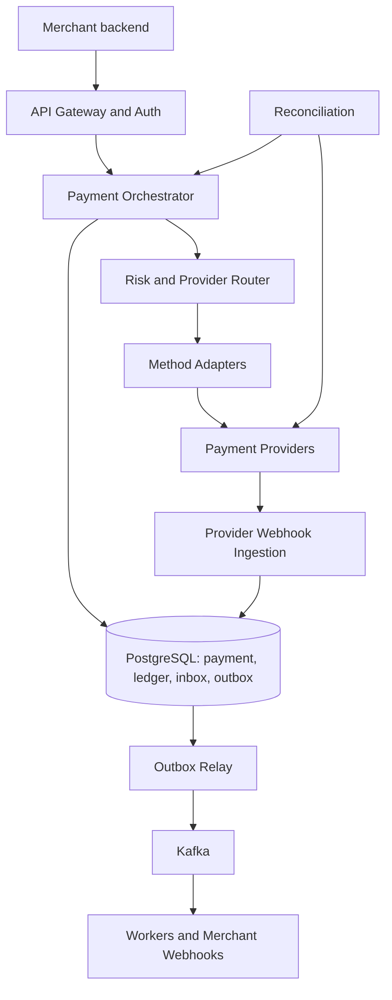

# Mock 06 — Payment Processing System (Attempt 01)

**Date:** 2026-10-06  
**Type:** HLD  
**Evaluator:** ChatGPT  
**Result:** 44/50 — Hire signal, with time-management and multi-region gaps  
**Re-attempt:** 2026-10-16

## Problem

Design a payment-processing platform for e-commerce merchants. It must support card, UPI, wallet and net-banking payments, authorization and capture, refunds, status tracking, provider webhooks, merchant webhooks, duplicate prevention, financial records and recovery from uncertain provider outcomes.

## Scorecard

| Area | Score | What was demonstrated | Main improvement |
|---|---:|---|---|
| Requirements | 9/10 | Good scope, actors, payment lifecycle, idempotency, refunds and provider uncertainty | State the payment and refund state machines separately; explicitly place chargebacks and settlement out of scope |
| Architecture | 9/10 | Clear orchestrator, adapters, router, PostgreSQL, Kafka, inbox/outbox, workers and reconciliation | Add the deployment and multi-region ownership model |
| Problem-solving | 10/10 | Excellent handling of ambiguous timeouts, concurrent refunds, ledger immutability, duplicate webhooks and outbox replays | Keep the same correctness while explaining fewer implementation details |
| Scale and trade-offs | 9/10 | Useful capacity estimates, bottlenecks, routing signals and failure classification | Complete RPO/RTO, database failover and regional failover |
| Communication | 7/10 | Answers were technically strong and structured | The answer is much larger than a 45–60 minute interview; use progressive disclosure |
| **Total** | **44/50** | **Strong senior-level design** | **Finish breadth first and deep-dive only where the interviewer asks** |

This is a practice score based on this transcript, not an external hiring result.

## What was especially strong

- Money uses integer minor units, not floating point.
- The database, not Redis, is the source of truth for idempotency.
- An unknown provider result remains `PROCESSING`; the system does not blindly try a second provider.
- The same provider reference is reused so the provider can deduplicate retries.
- Refund money is atomically reserved before calling the provider.
- Payment state, ledger entries and outbox events are committed together.
- Provider webhooks use a durable inbox and a unique deduplication key.
- Outbox delivery is at-least-once, while consumers make business effects idempotent.
- Ledger history is append-only and mistakes are corrected with reversal entries.
- Provider routing considers capability, health, success rate, latency, cost and merchant rules.
- Reconciliation uses both live status checks and settlement files.

## Important corrections

### 1. Provider timeout should not normally become `504`

The request was accepted and a payment resource already exists. If the provider outcome is uncertain, return:

```http
HTTP/1.1 202 Accepted
Location: /api/v1/payments/pay_123
Retry-After: 3
```

```json
{
  "id": "pay_123",
  "status": "PROCESSING"
}
```

A `504 Gateway Timeout` encourages the merchant to treat the whole operation as failed even though money may have moved. The merchant can safely retry with the same idempotency key, but `202 PROCESSING` communicates the real state better.

### 2. Idempotency replay must have one clear contract

For the same merchant, endpoint, key and request hash:

- Do not execute the operation again.
- Return the stored HTTP status and stored response from the original request.
- If the merchant needs the latest status, it calls `GET /payments/{id}`.
- The same key with a different request hash returns `409 Conflict` or a documented idempotency error.

Do not sometimes return the original response and sometimes replace it with the latest payment state. That makes retry behaviour unpredictable.

### 3. Use separate state machines

Payment states can be:

```text
CREATED -> REQUIRES_ACTION / PROCESSING -> AUTHORIZED / CAPTURED / FAILED
AUTHORIZED -> CAPTURED / VOIDED / EXPIRED
```

Refund is a separate resource:

```text
INITIATED -> PROCESSING -> SUCCEEDED / FAILED
```

Avoid using a single `REFUND` state on the payment because one payment may have several partial refunds.

### 4. Risk-service timeout policy needs guardrails

Fail-open versus fail-closed should not be a free merchant switch. A safer policy is:

- High-risk or regulated transaction: fail closed or require extra verification.
- Low-value, trusted transaction: allow with a limited fail-open rule.
- Enforce platform-wide limits even if a merchant chooses a more permissive policy.
- Record the decision for audit and monitor risk-service timeout rates.

### 5. PostgreSQL partitioning needs a key correction

The proposed `PRIMARY KEY (id, created_at)` works with range partitioning, but other tables cannot safely reference only `payment_id` with a normal foreign key. It also does not guarantee global uniqueness of `id` by itself.

Practical choices:

- Generate a globally unique payment ID and keep a small unpartitioned payment-routing table, while partitioning attempts/events by time.
- Partition payments by hash of `merchant_id` or `payment_id`, then sub-partition by time if necessary.
- Include the partition key in foreign keys, though this makes every child table and query more complex.

For an interview, mention this trade-off instead of writing full production DDL.

### 6. “Exactly-once effects” needs precise wording

Kafka and the outbox provide at-least-once delivery. Unique constraints, inbox records, state guards and idempotent handlers produce **effectively-once business outcomes**. Do not promise exactly-once delivery across PostgreSQL, Kafka and external providers.

### 7. API authentication needs stronger wording

`Basic base64` is encoding, not encryption. All calls require TLS. A production merchant API normally uses an API key plus request signing, OAuth client credentials, or mTLS, with key rotation and scoped permissions.

## Corrected final design



### Main components

1. **API Gateway:** TLS termination, authentication, rate limiting and request tracing.
2. **Merchant Configuration:** allowed methods, limits, provider rules, webhook endpoints and risk policy.
3. **Payment Orchestrator:** owns the payment state machine and transaction boundaries.
4. **Token Vault:** stores card data inside the PCI zone; the platform receives only tokens and masked metadata.
5. **Risk Service:** evaluates fraud signals with a small timeout budget.
6. **Provider Router:** filters and ranks providers and records why a provider was selected.
7. **Method Adapters:** translate the common payment model into each provider protocol.
8. **PostgreSQL:** source of truth for payments, attempts, refunds, idempotency, ledger, inbox and outbox.
9. **Kafka:** asynchronous distribution for merchant webhooks, status checks, refunds and analytics.
10. **Webhook Ingestion:** verifies signatures, saves raw events durably and deduplicates them.
11. **Reconciliation:** resolves unknown outcomes through provider APIs and settlement files.
12. **Observability and Audit:** metrics, traces, immutable audit events and operational dashboards.

### Normal automatic payment flow

1. Merchant sends `POST /payments` with a vault token and idempotency key.
2. Authenticate the merchant and validate amount, method and limits.
3. In one transaction, claim the idempotency key and create the payment.
4. Run the risk check, route the provider and create one live attempt.
5. Call the provider using the attempt ID as the provider idempotency reference.
6. On success, atomically update the payment, post balanced ledger entries and write an outbox event.
7. On an uncertain timeout, keep the attempt `UNKNOWN`, return `202 PROCESSING` and schedule reconciliation.

### Ambiguous provider outcome

Never try a second provider while the first attempt may have succeeded. Query the original provider with the same reference, accept its signed webhook, and later compare settlement files. Only a definite failure allows a new attempt.

### Ledger example for a ₹499 capture

Assuming the provider owes the platform and the platform owes the merchant:

| Account | Debit | Credit |
|---|---:|---:|
| Provider receivable | ₹499 | — |
| Merchant payable | — | ₹499 |

Refund reversal:

| Account | Debit | Credit |
|---|---:|---:|
| Merchant payable | ₹499 | — |
| Provider receivable | — | ₹499 |

Fees and taxes add more balanced entries. Account meanings must be agreed with finance; the important invariant is that every transaction balances per currency.

## Missing interview questions and model answers

### How would you deploy this across regions?

Use active-active stateless services but give each merchant or payment a **home write region**. Global routing sends writes to that region. The other region can serve safe reads and accept webhooks, but it forwards money-changing commands to the home region. PostgreSQL replicates to the disaster-recovery region. This avoids two independent leaders accepting the same payment.

### How is cross-region idempotency protected?

The strongest protection is a single authoritative write region for a merchant/payment and a database unique constraint on `(merchant_id, endpoint, idempotency_key)`. Do not depend on two asynchronously replicated Redis clusters. If the home region is unavailable and ownership cannot be safely transferred, reject or delay the payment rather than risk a duplicate charge.

### What are suitable RPO and RTO targets?

- **Within one region:** synchronous multi-AZ PostgreSQL; RPO near zero and automatic failover in roughly 30–120 seconds.
- **Regional disaster:** target RPO under one minute and RTO around 5–15 minutes, depending on replication and business cost.
- Ledger backups need point-in-time recovery and regularly tested restore procedures.

Exact numbers are business decisions, but they must be measurable and tested.

### What if a webhook reaches the wrong region?

Verify and durably save it in the local inbox, then route it using the provider reference to the payment's home shard/region. A globally replicated routing record maps the provider reference to the owning payment. Duplicates remain harmless because the inbox key and state transition are unique.

### What if PostgreSQL fails during the transaction?

The transaction either commits fully or rolls back. The client retries with the same idempotency key. A multi-AZ standby becomes leader. The application must discard old connections, discover the new leader and retry only safe database work. If a provider call may already have happened, do not repeat it blindly; reconcile using the existing attempt reference.

### Regional-outage example

The provider captured ₹499, but the primary region failed before storing the response:

1. The attempt was already stored as `SENT` before the provider call.
2. The customer retry reaches the secondary region with the same idempotency key.
3. If ownership has not safely failed over, return `202 PROCESSING` or temporary-unavailable rather than creating a second payment.
4. After database promotion, the unique idempotency record returns the same payment ID.
5. The status worker queries the original provider using the original attempt ID, or processes the provider webhook.
6. It records `CAPTURED`, posts the ledger and emits the outbox event once.
7. Reconciliation later verifies the transaction against the provider settlement file.

### What should be monitored?

- Payment success rate by provider, method, bank and merchant.
- `PROCESSING` and `UNKNOWN` age distribution.
- Provider latency, timeout rate and circuit-breaker state.
- Duplicate-key and duplicate-webhook counts.
- Outbox lag, Kafka consumer lag and webhook-delivery lag.
- Ledger imbalance checks and reconciliation mismatches.
- Refund reservation age and failed-refund rate.
- Database lock time, connection-pool saturation and replica lag.

### What security details should be stated?

- Hosted fields or provider SDK prevents the platform from receiving PAN/CVV.
- CVV is never stored.
- Encrypt PII and provider credentials with managed keys; rotate keys.
- Redact tokens, authorization headers and personal data from logs.
- Verify webhook signature over the exact raw body and timestamp; prevent replay.
- Apply least privilege, mTLS/service identity and an immutable audit trail.
- Separate PCI workloads and restrict operator access.

### What is deliberately out of scope?

Merchant KYC/onboarding, multi-currency settlement, recurring billing, disputes/chargebacks and detailed fraud-model design. Mention how the architecture could add them, but do not design them unless asked.

## How to solve this in 45–60 minutes

You are **not expected to explain every detail written in this report**. The report is revision material. In an interview, first show a complete design, then let the interviewer choose the deep dive.

### Recommended 60-minute plan

| Time | Topic | What to deliver |
|---:|---|---|
| 0–5 min | Requirements | Scope, actors, payment methods, auth/capture, refunds, webhooks, three important failure cases |
| 5–8 min | Scale and SLOs | Average/peak RPS, write-heavy nature, latency and availability targets |
| 8–13 min | APIs and states | Five main APIs, idempotency contract, payment and refund state machines |
| 13–18 min | Data model | Payment, Attempt, Refund, Idempotency, Ledger, Inbox and Outbox—names and constraints only |
| 18–28 min | Architecture | Draw the main components and explain one normal payment flow |
| 28–43 min | Critical deep dives | Idempotency, unknown provider outcome, concurrent refunds and balanced ledger |
| 43–52 min | Reliability | Webhook dedupe, outbox, reconciliation, provider routing and database failure |
| 52–57 min | Scale/security | Partitioning, bottlenecks, PCI/tokenization and monitoring |
| 57–60 min | Summary | Requirements met, strongest trade-offs, remaining extensions |

### What to avoid in the live interview

- Do not write complete SQL DDL unless asked. Say the tables, important fields, unique constraints and transaction boundaries.
- Do not explain seven complete flows. Explain one payment flow, then describe how UPI, capture and refund differ.
- Do not list every retry delay. Say exponential backoff with jitter, a maximum attempt/time limit and DLQ/ops handling.
- Do not design all provider APIs. Use one adapter interface and one example.
- Do not spend ten minutes calculating exact storage. Give rounded numbers and connect them to a decision.
- Do not answer every possible follow-up before the interviewer asks it.

### A compact opening answer

> I will first clarify payment methods, authorization versus capture, refunds, idempotency and what is out of scope. Then I will estimate peak payment traffic, define the APIs and state machines, draw the main components, and deep-dive into the hardest parts: duplicate prevention, uncertain provider outcomes, ledger correctness and reconciliation. I will finish with failures, security and scaling.

### A two-minute closing summary

> The Payment Orchestrator owns a durable state machine in PostgreSQL. Every request is protected by a merchant-scoped idempotency key. We store an attempt before calling a provider and never switch providers while an outcome is uncertain. Payment state, balanced ledger entries and outbox events commit together. Provider webhooks use a durable inbox, and reconciliation resolves missing or conflicting results. Kafka is used for asynchronous work, but PostgreSQL remains the source of truth. Stateless services scale horizontally, provider adapters are isolated, and tokenization keeps card data outside the main system.

## Corrective exercises before re-attempt

1. Explain the multi-region outage example in three minutes without notes.
2. Explain the idempotency response contract and unknown-result handling in two minutes.
3. Redraw the architecture and finish a complete verbal design in 45 minutes.
4. Explain the partition-key problem in the proposed PostgreSQL schema.
5. Give the two-minute closing summary without reading it.

## Re-attempt goal

Complete the whole design in 45–50 minutes, reserve the final 10 minutes for interviewer questions, and answer the regional-outage scenario without risking a second charge.
