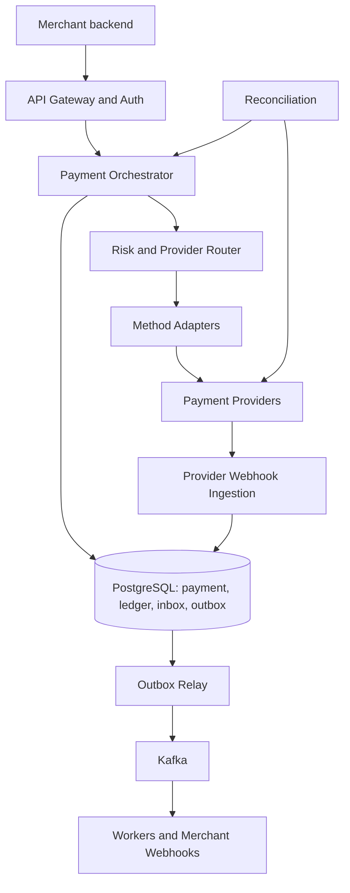
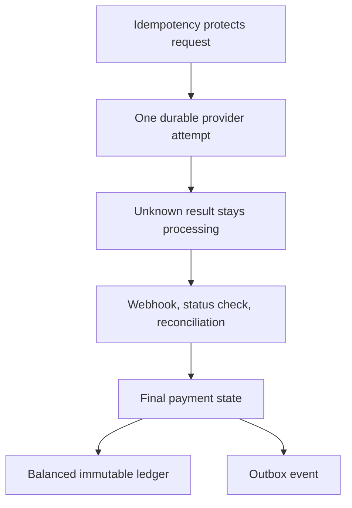

# Mock 06 — Payment Processing System (Attempt 01)

**Date:** 2026-10-06  
**Type:** HLD  
**Evaluator:** ChatGPT  
**Result:** 44/50 — Hire signal, with time-management and multi-region gaps  
**Re-attempt:** 2026-10-16

## Problem

Design a payment-processing platform for e-commerce merchants. It must support card, UPI, wallet and net-banking payments, authorization and capture, refunds, status tracking, provider webhooks, merchant webhooks, duplicate prevention, financial records and recovery from uncertain provider outcomes.

## Scorecard

| Area | Score | What was demonstrated | Main improvement |
|---|---:|---|---|
| Requirements | 9/10 | Good scope, actors, payment lifecycle, idempotency, refunds and provider uncertainty | State the payment and refund state machines separately; explicitly place chargebacks and settlement out of scope |
| Architecture | 9/10 | Clear orchestrator, adapters, router, PostgreSQL, Kafka, inbox/outbox, workers and reconciliation | Add the deployment and multi-region ownership model |
| Problem-solving | 10/10 | Excellent handling of ambiguous timeouts, concurrent refunds, ledger immutability, duplicate webhooks and outbox replays | Keep the same correctness while explaining fewer implementation details |
| Scale and trade-offs | 9/10 | Useful capacity estimates, bottlenecks, routing signals and failure classification | Complete RPO/RTO, database failover and regional failover |
| Communication | 7/10 | Answers were technically strong and structured | The answer is much larger than a 45–60 minute interview; use progressive disclosure |
| **Total** | **44/50** | **Strong senior-level design** | **Finish breadth first and deep-dive only where the interviewer asks** |

This is a practice score based on this transcript, not an external hiring result.

## What was especially strong

- Money uses integer minor units, not floating point.
- The database, not Redis, is the source of truth for idempotency.
- An unknown provider result remains `PROCESSING`; the system does not blindly try a second provider.
- The same provider reference is reused so the provider can deduplicate retries.
- Refund money is atomically reserved before calling the provider.
- Payment state, ledger entries and outbox events are committed together.
- Provider webhooks use a durable inbox and a unique deduplication key.
- Outbox delivery is at-least-once, while consumers make business effects idempotent.
- Ledger history is append-only and mistakes are corrected with reversal entries.
- Provider routing considers capability, health, success rate, latency, cost and merchant rules.
- Reconciliation uses both live status checks and settlement files.

## Important corrections

### 1. Provider timeout should not normally become `504`

The request was accepted and a payment resource already exists. If the provider outcome is uncertain, return:

```http
HTTP/1.1 202 Accepted
Location: /api/v1/payments/pay_123
Retry-After: 3
```

```json
{
  "id": "pay_123",
  "status": "PROCESSING"
}
```

A `504 Gateway Timeout` encourages the merchant to treat the whole operation as failed even though money may have moved. The merchant can safely retry with the same idempotency key, but `202 PROCESSING` communicates the real state better.

### 2. Idempotency replay must have one clear contract

For the same merchant, endpoint, key and request hash:

- Do not execute the operation again.
- Return the stored HTTP status and stored response from the original request.
- If the merchant needs the latest status, it calls `GET /payments/{id}`.
- The same key with a different request hash returns `409 Conflict` or a documented idempotency error.

Do not sometimes return the original response and sometimes replace it with the latest payment state. That makes retry behaviour unpredictable.

### 3. Use separate state machines

Payment states can be:

```text
CREATED -> REQUIRES_ACTION / PROCESSING -> AUTHORIZED / CAPTURED / FAILED
AUTHORIZED -> CAPTURED / VOIDED / EXPIRED
```

Refund is a separate resource:

```text
INITIATED -> PROCESSING -> SUCCEEDED / FAILED
```

Avoid using a single `REFUND` state on the payment because one payment may have several partial refunds.

### 4. Risk-service timeout policy needs guardrails

Fail-open versus fail-closed should not be a free merchant switch. A safer policy is:

- High-risk or regulated transaction: fail closed or require extra verification.
- Low-value, trusted transaction: allow with a limited fail-open rule.
- Enforce platform-wide limits even if a merchant chooses a more permissive policy.
- Record the decision for audit and monitor risk-service timeout rates.

### 5. PostgreSQL partitioning needs a key correction

The proposed `PRIMARY KEY (id, created_at)` works with range partitioning, but other tables cannot safely reference only `payment_id` with a normal foreign key. It also does not guarantee global uniqueness of `id` by itself.

Practical choices:

- Generate a globally unique payment ID and keep a small unpartitioned payment-routing table, while partitioning attempts/events by time.
- Partition payments by hash of `merchant_id` or `payment_id`, then sub-partition by time if necessary.
- Include the partition key in foreign keys, though this makes every child table and query more complex.

For an interview, mention this trade-off instead of writing full production DDL.

### 6. “Exactly-once effects” needs precise wording

Kafka and the outbox provide at-least-once delivery. Unique constraints, inbox records, state guards and idempotent handlers produce **effectively-once business outcomes**. Do not promise exactly-once delivery across PostgreSQL, Kafka and external providers.

### 7. API authentication needs stronger wording

`Basic base64` is encoding, not encryption. All calls require TLS. A production merchant API normally uses an API key plus request signing, OAuth client credentials, or mTLS, with key rotation and scoped permissions.

## Corrected final design



### Main components

1. **API Gateway:** TLS termination, authentication, rate limiting and request tracing.
2. **Merchant Configuration:** allowed methods, limits, provider rules, webhook endpoints and risk policy.
3. **Payment Orchestrator:** owns the payment state machine and transaction boundaries.
4. **Token Vault:** stores card data inside the PCI zone; the platform receives only tokens and masked metadata.
5. **Risk Service:** evaluates fraud signals with a small timeout budget.
6. **Provider Router:** filters and ranks providers and records why a provider was selected.
7. **Method Adapters:** translate the common payment model into each provider protocol.
8. **PostgreSQL:** source of truth for payments, attempts, refunds, idempotency, ledger, inbox and outbox.
9. **Kafka:** asynchronous distribution for merchant webhooks, status checks, refunds and analytics.
10. **Webhook Ingestion:** verifies signatures, saves raw events durably and deduplicates them.
11. **Reconciliation:** resolves unknown outcomes through provider APIs and settlement files.
12. **Observability and Audit:** metrics, traces, immutable audit events and operational dashboards.

### Normal automatic payment flow

1. Merchant sends `POST /payments` with a vault token and idempotency key.
2. Authenticate the merchant and validate amount, method and limits.
3. In one transaction, claim the idempotency key and create the payment.
4. Run the risk check, route the provider and create one live attempt.
5. Call the provider using the attempt ID as the provider idempotency reference.
6. On success, atomically update the payment, post balanced ledger entries and write an outbox event.
7. On an uncertain timeout, keep the attempt `UNKNOWN`, return `202 PROCESSING` and schedule reconciliation.

### Ambiguous provider outcome

Never try a second provider while the first attempt may have succeeded. Query the original provider with the same reference, accept its signed webhook, and later compare settlement files. Only a definite failure allows a new attempt.

### Ledger example for a ₹499 capture

Assuming the provider owes the platform and the platform owes the merchant:

| Account | Debit | Credit |
|---|---:|---:|
| Provider receivable | ₹499 | — |
| Merchant payable | — | ₹499 |

Refund reversal:

| Account | Debit | Credit |
|---|---:|---:|
| Merchant payable | ₹499 | — |
| Provider receivable | — | ₹499 |

Fees and taxes add more balanced entries. Account meanings must be agreed with finance; the important invariant is that every transaction balances per currency.

## Missing interview questions and model answers

### How would you deploy this across regions?

Use active-active stateless services but give each merchant or payment a **home write region**. Global routing sends writes to that region. The other region can serve safe reads and accept webhooks, but it forwards money-changing commands to the home region. PostgreSQL replicates to the disaster-recovery region. This avoids two independent leaders accepting the same payment.

### How is cross-region idempotency protected?

The strongest protection is a single authoritative write region for a merchant/payment and a database unique constraint on `(merchant_id, endpoint, idempotency_key)`. Do not depend on two asynchronously replicated Redis clusters. If the home region is unavailable and ownership cannot be safely transferred, reject or delay the payment rather than risk a duplicate charge.

### What are suitable RPO and RTO targets?

- **Within one region:** synchronous multi-AZ PostgreSQL; RPO near zero and automatic failover in roughly 30–120 seconds.
- **Regional disaster:** target RPO under one minute and RTO around 5–15 minutes, depending on replication and business cost.
- Ledger backups need point-in-time recovery and regularly tested restore procedures.

Exact numbers are business decisions, but they must be measurable and tested.

### What if a webhook reaches the wrong region?

Verify and durably save it in the local inbox, then route it using the provider reference to the payment's home shard/region. A globally replicated routing record maps the provider reference to the owning payment. Duplicates remain harmless because the inbox key and state transition are unique.

### What if PostgreSQL fails during the transaction?

The transaction either commits fully or rolls back. The client retries with the same idempotency key. A multi-AZ standby becomes leader. The application must discard old connections, discover the new leader and retry only safe database work. If a provider call may already have happened, do not repeat it blindly; reconcile using the existing attempt reference.

### Regional-outage example

The provider captured ₹499, but the primary region failed before storing the response:

1. The attempt was already stored as `SENT` before the provider call.
2. The customer retry reaches the secondary region with the same idempotency key.
3. If ownership has not safely failed over, return `202 PROCESSING` or temporary-unavailable rather than creating a second payment.
4. After database promotion, the unique idempotency record returns the same payment ID.
5. The status worker queries the original provider using the original attempt ID, or processes the provider webhook.
6. It records `CAPTURED`, posts the ledger and emits the outbox event once.
7. Reconciliation later verifies the transaction against the provider settlement file.

### What should be monitored?

- Payment success rate by provider, method, bank and merchant.
- `PROCESSING` and `UNKNOWN` age distribution.
- Provider latency, timeout rate and circuit-breaker state.
- Duplicate-key and duplicate-webhook counts.
- Outbox lag, Kafka consumer lag and webhook-delivery lag.
- Ledger imbalance checks and reconciliation mismatches.
- Refund reservation age and failed-refund rate.
- Database lock time, connection-pool saturation and replica lag.

### What security details should be stated?

- Hosted fields or provider SDK prevents the platform from receiving PAN/CVV.
- CVV is never stored.
- Encrypt PII and provider credentials with managed keys; rotate keys.
- Redact tokens, authorization headers and personal data from logs.
- Verify webhook signature over the exact raw body and timestamp; prevent replay.
- Apply least privilege, mTLS/service identity and an immutable audit trail.
- Separate PCI workloads and restrict operator access.

### What is deliberately out of scope?

Merchant KYC/onboarding, multi-currency settlement, recurring billing, disputes/chargebacks and detailed fraud-model design. Mention how the architecture could add them, but do not design them unless asked.

## How to solve this in 45–60 minutes

You are **not expected to explain every detail written in this report**. The report is revision material. In an interview, first show a complete design, then let the interviewer choose the deep dive.

### Recommended 60-minute plan

| Time | Topic | What to deliver |
|---:|---|---|
| 0–5 min | Requirements | Scope, actors, payment methods, auth/capture, refunds, webhooks, three important failure cases |
| 5–8 min | Scale and SLOs | Average/peak RPS, write-heavy nature, latency and availability targets |
| 8–13 min | APIs and states | Five main APIs, idempotency contract, payment and refund state machines |
| 13–18 min | Data model | Payment, Attempt, Refund, Idempotency, Ledger, Inbox and Outbox—names and constraints only |
| 18–28 min | Architecture | Draw the main components and explain one normal payment flow |
| 28–43 min | Critical deep dives | Idempotency, unknown provider outcome, concurrent refunds and balanced ledger |
| 43–52 min | Reliability | Webhook dedupe, outbox, reconciliation, provider routing and database failure |
| 52–57 min | Scale/security | Partitioning, bottlenecks, PCI/tokenization and monitoring |
| 57–60 min | Summary | Requirements met, strongest trade-offs, remaining extensions |

### What to avoid in the live interview

- Do not write complete SQL DDL unless asked. Say the tables, important fields, unique constraints and transaction boundaries.
- Do not explain seven complete flows. Explain one payment flow, then describe how UPI, capture and refund differ.
- Do not list every retry delay. Say exponential backoff with jitter, a maximum attempt/time limit and DLQ/ops handling.
- Do not design all provider APIs. Use one adapter interface and one example.
- Do not spend ten minutes calculating exact storage. Give rounded numbers and connect them to a decision.
- Do not answer every possible follow-up before the interviewer asks it.

### A compact opening answer

> I will first clarify payment methods, authorization versus capture, refunds, idempotency and what is out of scope. Then I will estimate peak payment traffic, define the APIs and state machines, draw the main components, and deep-dive into the hardest parts: duplicate prevention, uncertain provider outcomes, ledger correctness and reconciliation. I will finish with failures, security and scaling.

### A two-minute closing summary

> The Payment Orchestrator owns a durable state machine in PostgreSQL. Every request is protected by a merchant-scoped idempotency key. We store an attempt before calling a provider and never switch providers while an outcome is uncertain. Payment state, balanced ledger entries and outbox events commit together. Provider webhooks use a durable inbox, and reconciliation resolves missing or conflicting results. Kafka is used for asynchronous work, but PostgreSQL remains the source of truth. Stateless services scale horizontally, provider adapters are isolated, and tokenization keeps card data outside the main system.

## Corrective exercises before re-attempt

1. Explain the multi-region outage example in three minutes without notes.
2. Explain the idempotency response contract and unknown-result handling in two minutes.
3. Redraw the architecture and finish a complete verbal design in 45 minutes.
4. Explain the partition-key problem in the proposed PostgreSQL schema.
5. Give the two-minute closing summary without reading it.

## Re-attempt goal

Complete the whole design in 45–50 minutes, reserve the final 10 minutes for interviewer questions, and answer the regional-outage scenario without risking a second charge.

## Revision Deep Dives

These are the four topics to prepare most deeply. In the live interview, first give the short answer. Expand into the detailed flow only when the interviewer asks a follow-up.

## Deep Dive 1: Duplicate Payment Prevention

### The problem

A merchant may send the same payment more than once because:

- The customer double-clicks the Pay button.
- The merchant times out and retries.
- A load balancer retries a request.
- Two application instances process the same request concurrently.
- Kafka redelivers an event.
- A provider sends the same webhook more than once.

Preventing duplicates at only one layer is not sufficient. We need protection from the API boundary to the external provider and all asynchronous consumers.

### Layer 1: Merchant request idempotency

The merchant sends an idempotency key with every money-changing request:

```http
POST /api/v1/payments
Idempotency-Key: 7b9b2c34-921e-4512-bc78-75c123f8101a
```

The database stores:

```text
IdempotencyRecord
- merchant_id
- endpoint
- idempotency_key
- request_hash
- status: IN_PROGRESS or COMPLETED
- resource_id
- response_status
- response_body
- expires_at
```

The database has a unique constraint on:

```text
(merchant_id, endpoint, idempotency_key)
```

The request hash is calculated from a canonical form of the business payload. Authentication headers, tracing headers and JSON field order should not change the hash.

### Two simultaneous requests

1. Request A and Request B arrive with the same key.
2. Both try to insert the idempotency record.
3. The database unique constraint allows only one insert.
4. Request A creates the payment.
5. Request B reads the existing idempotency record.
6. If it is `COMPLETED`, Request B receives the stored original response.
7. If it is `IN_PROGRESS`, Request B can wait briefly or receive `409 Request In Progress`/`202 Processing`, depending on the published API contract.

The important rule is that Request B never calls the provider.

### Same key with a different request

If the merchant reuses the key but changes the amount, currency or payment method, the request hash will differ. Return a documented error such as:

```http
HTTP/1.1 409 Conflict
```

```json
{
  "error": "idempotency_key_reused",
  "message": "The idempotency key was already used with a different request."
}
```

Never silently reuse the old payment for a different amount.

### Layer 2: Only one unresolved provider attempt

The `PaymentAttempt` table has a partial unique constraint that allows only one live attempt per payment:

```text
UNIQUE payment_id WHERE status IN (INITIATED, SENT, UNKNOWN)
```

This prevents two service instances from calling two providers for the same unresolved payment.

### Layer 3: Provider-side idempotency

Our stable `attempt_id` is sent to the provider as its idempotency key or merchant reference. If the network fails and we retry the same provider call, we reuse the same attempt ID.

We do not generate a new attempt ID for a network retry because the provider could treat it as a new charge.

### Layer 4: Webhook deduplication

Provider webhook events are inserted into an inbox with:

```text
UNIQUE (provider, provider_event_id)
```

Duplicate delivery receives `200 OK`, but its business logic is not executed again.

### Layer 5: Event-consumer deduplication

The outbox relay may publish the same event more than once. Each consumer stores the stable event ID or uses a natural unique constraint. The dedupe record and the consumer's business update must happen in the same database transaction.

Examples:

- Merchant delivery: `UNIQUE(endpoint_id, event_id)`.
- Ledger posting: `UNIQUE(reference_type, reference_id, entry_purpose)`.
- Payment state update: expected state plus version check.

### Why Redis alone is unsafe

Redis is useful as a fast first check, but it is not the final guarantee. A key can disappear because of expiration, eviction, restart or failover. PostgreSQL's unique constraint remains the source of truth.

### Crash cases to explain

| Crash point | Recovery behaviour |
|---|---|
| Before idempotency transaction commits | Retry can safely create the payment |
| After payment commits but before provider call | Retry finds the same payment; worker can continue using the stored attempt |
| After provider call but before response is saved | Attempt is `SENT`/`UNKNOWN`; reconcile using the same reference |
| After state commits but before API response | Retry returns the stored result; no new provider call |
| After outbox publish but before marking published | Event may be published again; consumers deduplicate it |

### Two-minute interview answer

> I prevent duplicate payments at several layers. The merchant sends an idempotency key, and PostgreSQL has a unique constraint scoped by merchant and endpoint. The record stores a request hash and the original response. The same key and same payload return that response; the same key with a different payload returns a conflict. Before calling a provider, I create one live payment attempt, and I send its stable ID to the provider as its idempotency reference. Provider webhooks use an inbox with a unique event ID, while Kafka consumers deduplicate stable outbox event IDs in the same transaction as their effect. Redis may reduce duplicate traffic, but database constraints provide correctness.

### Common mistakes

- Keeping the idempotency key only in Redis.
- Scoping the key globally instead of by merchant and endpoint.
- Not comparing the request hash.
- Generating a new provider reference for every network retry.
- Returning the current payment state sometimes and the original response other times without a documented contract.
- Assuming Kafka exactly-once automatically prevents external duplicate charges.

## Deep Dive 2: Unknown Provider Outcome

### The problem

Our system sends a charge request to the provider. The provider may process it, but the connection times out before we receive the response. We cannot safely say that the payment failed, and we cannot safely charge through another provider.

### Prepare before calling the provider

Before making the external call, commit:

- Payment status `PROCESSING`.
- Payment attempt status `SENT`.
- Stable attempt ID/provider reference.
- Selected provider and request information needed for recovery.

This transaction gives the recovery worker a durable record even if the application crashes immediately afterward.

### Classify failures correctly

| Failure type | Example | Can another attempt start? |
|---|---|---|
| Definite failure before sending | DNS lookup failed, connection refused before request was written | Yes, after recording the failure |
| Definite provider rejection | Invalid request, unsupported method, clear decline | Usually no retry for customer decline; routing retry may be allowed for a provider-specific rejection |
| Ambiguous failure | Read timeout, connection reset after write, uncertain provider `5xx` | No |

The exact boundary between definite and ambiguous depends on the HTTP client and provider contract. When uncertain, treat it as ambiguous.

### Handling an ambiguous result

1. Mark the attempt `UNKNOWN`.
2. Keep the payment `PROCESSING`.
3. Return `202 Accepted` with the payment ID and status URL.
4. Do not release the one-live-attempt constraint.
5. Schedule a status query against the same provider.
6. Accept a signed provider webhook if it arrives first.
7. Resolve the state through one idempotent `applyAttemptResult` function.

```http
HTTP/1.1 202 Accepted
Location: /api/v1/payments/pay_123
Retry-After: 3
```

### Why not return `504`?

`504` suggests that the whole operation failed, even though the provider might have captured the money. `202 PROCESSING` communicates that our request was accepted but the final financial outcome is not yet known.

### Status-check strategy

Use increasing delays with jitter, for example:

```text
5 seconds -> 15 seconds -> 1 minute -> 5 minutes -> 30 minutes -> 2 hours
```

Rate-limit status checks per provider so that a provider outage does not create a retry storm. After the automatic window ends, move the payment to an operations queue while daily reconciliation continues.

### Late success

A success webhook may arrive after the checkout page shows a timeout or after the merchant order expires. Financial truth must still record the successful capture. Then notify the merchant. The merchant may fulfil the order or issue a refund according to its business policy.

Do not hide or discard a genuine capture just because it arrived late.

### What if the provider says “not found”?

Some providers have eventual consistency. A newly created payment may not immediately appear in their status API. Apply a grace period and repeat the query before treating `not found` as definite failure.

### Never fail over an unresolved payment

Provider B must not receive the payment while Provider A may have succeeded. Failover is allowed only when we know the first request was not processed. If an ambiguous attempt is retried, retry Provider A with the same reference.

### Two-minute interview answer

> Before calling the provider, I commit a `PROCESSING` payment and a `SENT` attempt with a stable provider reference. If the request times out after it may have been sent, I mark the attempt `UNKNOWN`, return `202 PROCESSING`, and keep the one-live-attempt guard. I never send the same payment to another provider while the first outcome is unresolved. A worker queries the original provider with the same reference, while a signed webhook can also resolve it. Both paths use one idempotent state-transition function. If neither resolves it, settlement-file reconciliation provides the final financial truth.

### Common mistakes

- Treating timeout as payment failure.
- Trying another provider immediately.
- Generating a new provider reference during the retry.
- Marking the payment failed because the first status query says `not found`.
- Trusting the browser redirect as proof of payment.
- Automatically refunding before confirming that money was captured.

## Deep Dive 3: Ledger Correctness

### Why payment status is not a ledger

A `CAPTURED` status tells us the operational state, but it cannot answer every financial question:

- How much does the provider owe us?
- How much do we owe the merchant?
- What fees did we earn?
- Which refund reversed which payment?
- How was a wrong entry corrected?

The ledger is a separate, append-only financial record.

### Basic model

```text
LedgerAccount
- account_id
- owner
- purpose
- currency
- normal_side

LedgerTransaction
- ledger_transaction_id
- reference_type
- reference_id
- transaction_type
- reverses_transaction_id
- posted_at

LedgerEntry
- ledger_transaction_id
- line_number
- account_id
- direction: DEBIT or CREDIT
- amount_minor
- currency
```

Each ledger transaction contains at least two entries. For each currency:

```text
sum(debits) = sum(credits)
```

### ₹499 capture example

Assume the provider owes our platform the captured money, and our platform owes the merchant:

| Account | Debit | Credit |
|---|---:|---:|
| Provider receivable | ₹499 | — |
| Merchant payable | — | ₹499 |

If the platform charges a ₹10 fee, the merchant liability can be split:

| Account | Debit | Credit |
|---|---:|---:|
| Provider receivable | ₹499 | — |
| Merchant payable | — | ₹489 |
| Platform fee revenue | — | ₹10 |

The exact account names and posting rules must be agreed with finance. The system-design invariant is that the transaction always balances.

### ₹100 partial refund example

| Account | Debit | Credit |
|---|---:|---:|
| Merchant payable | ₹100 | — |
| Provider receivable | — | ₹100 |

Fee reversal, tax and provider-fee rules may add more entries.

### Atomic posting

When capture succeeds, the following happen in one PostgreSQL transaction:

1. Validate the expected current payment state and version.
2. Update the payment to `CAPTURED`.
3. Insert the ledger transaction.
4. Insert balanced ledger entries.
5. Insert the outbox event.
6. Commit.

This prevents these bad states:

- Payment says `CAPTURED`, but no ledger exists.
- Ledger records money, but payment still says `PROCESSING`.
- Payment and ledger commit, but downstream systems never receive the event.

### Enforcing balance

Use a controlled posting function or stored procedure that receives all lines, verifies currency and debit/credit totals, and commits the complete transaction. Database constraints prevent duplicate posting for the same business reference.

Do not insert one line, commit it, and insert the matching line later.

### Immutability and corrections

Ledger entries are never updated or deleted. If a ₹499 payment was posted to the wrong merchant:

1. Create a reversal transaction containing the opposite entries.
2. Link it using `reverses_transaction_id`.
3. Create a new correct transaction.
4. Keep all three transactions for audit.

### Preventing duplicate ledger posting

Use a unique reference such as:

```text
(transaction_type, reference_type, reference_id)
```

If a `PAYMENT_CAPTURED` event is replayed, the unique constraint prevents a second capture posting.

### Do not update one hot balance row

Ledger entries are the source of truth. A running merchant balance can be maintained as a projection or periodic snapshot, but it should not replace the immutable entries. This reduces contention on a single balance row and makes the balance rebuildable.

### Authorization versus capture

An authorization reserves spending capacity but may not move settled money. The financial ledger usually posts the main money movement on capture. If the business needs to track authorization holds, use separate memo/hold accounts rather than pretending it is settled cash.

### Two-minute interview answer

> Payment status is not sufficient for accounting, so I keep a separate append-only double-entry ledger. Every financial transaction has balanced debit and credit entries in the same currency. On capture, the provider receivable is debited and the merchant payable is credited. Payment state, ledger entries and the outbox event commit in one database transaction. A unique business reference prevents duplicate posting. Ledger rows are never edited or deleted; mistakes are fixed with linked reversal entries. Running balances are projections that can be rebuilt from the immutable ledger.

### Common mistakes

- Using the payment table itself as the financial ledger.
- Maintaining only one mutable balance column.
- Using `double` or `float` for amounts.
- Updating or deleting old ledger entries.
- Posting debit and credit in separate transactions.
- Allowing duplicate events to post the same financial movement twice.
- Mixing multiple currencies inside one balanced transaction.

## Deep Dive 4: Reconciliation

### Why reconciliation is required

Distributed payment systems cannot depend only on synchronous API responses. Requests time out, webhooks are delayed, events are lost temporarily, operators make corrections, and providers may report a different result later.

Reconciliation compares our records with the provider's financial truth and finds mismatches.

### Layer 1: Continuous online reconciliation

A sweeper continuously finds attempts that are stuck in `SENT`, `UNKNOWN` or `PROCESSING` beyond a threshold.

For each attempt:

1. Read the provider and stable provider reference.
2. Call the provider status API.
3. Map the provider response to our common result.
4. Apply it through the same idempotent state-machine function used by webhooks.
5. Schedule another check with backoff if the result is still unknown.
6. Move very old unresolved cases to an operations queue.

Use `FOR UPDATE SKIP LOCKED` or a lease so that multiple workers can scan safely without processing the same row concurrently.

### Layer 2: Daily settlement-file reconciliation

Providers publish transaction or settlement files. Store the raw file in immutable object storage, record its checksum and load its rows into staging tables.

Match rows using, in order:

1. Our merchant/attempt reference.
2. Provider transaction reference.
3. Merchant, amount, currency and time window as a controlled fallback.

Do not automatically match using amount and timestamp alone when the result is ambiguous.

### Mismatch types

| Our system | Provider | Meaning | Action |
|---|---|---|---|
| `PROCESSING` | Captured | We missed the success | Mark captured, post ledger, notify merchant |
| `CAPTURED` | Failed/not found | Serious inconsistency | Re-query and send to operations; do not erase ledger automatically |
| `FAILED` | Captured | Late or missed success | Record capture and notify merchant; merchant may refund |
| Refund `PROCESSING` | Refunded | We missed refund success | Complete refund and reversal ledger posting |
| Captured amount differs | Different amount | Partial capture, fee or data defect | Investigate using provider detail; create controlled correction |
| Provider row has no local record | Unmatched external transaction | Possible integration or fraud issue | Quarantine and alert operations |
| Local record has no provider row | Missing settlement | Provider delay or failed settlement | Carry forward and escalate by age |

### Idempotent correction

Reconciliation must not bypass the normal state machine. It calls the same `applyAttemptResult` function with:

- Stable attempt ID.
- Provider result and reference.
- Source `RECONCILIATION`.
- Provider effective time.
- Evidence such as file ID and row number.

The function uses version checks and unique ledger references, making repeated reconciliation runs harmless.

### Do not rewrite financial history

If reconciliation finds a ledger mistake, create a reversal and a corrected transaction. Never update an existing ledger entry merely to make the numbers match.

### Operational design

- Run heavy file processing away from the primary payment workload.
- Partition work by provider and settlement date.
- Rate-limit provider status APIs.
- Keep a mismatch table with owner, severity, age and resolution status.
- Preserve raw provider files, checksums and parsing versions for audit.
- Make every manual correction require a reason, operator identity and approval when needed.

### Important metrics

- Count and total value of mismatches.
- Oldest unresolved mismatch.
- `UNKNOWN` payment age.
- Percentage automatically reconciled.
- Unmatched provider and unmatched local records.
- Settlement-file arrival and processing delay.
- Manual correction count and value.

### Example

The provider captured ₹499, but our service crashed before saving the response:

1. The local payment remains `PROCESSING`, and the attempt remains `SENT` or becomes `UNKNOWN`.
2. The online sweeper queries the provider using our attempt reference.
3. If the provider reports success, `applyAttemptResult` marks the payment `CAPTURED`, posts the balanced ledger entries and creates the outbox event.
4. If the online query never resolves, the daily settlement file contains the captured transaction.
5. The reconciliation job matches it using the attempt/provider reference and performs the same idempotent correction.
6. If the job runs again, version checks and unique ledger references prevent duplicate effects.

### Two-minute interview answer

> Reconciliation has two layers. A continuous sweeper checks attempts that remain `SENT`, `UNKNOWN` or `PROCESSING` and queries the provider using our stable reference. A daily job loads provider settlement files and compares them with payments, refunds and ledger postings. Mismatches are classified, and safe cases are corrected through the same idempotent state-transition function used by webhooks. Financial corrections create reversal entries rather than changing ledger history. Ambiguous or high-value mismatches go to an operations queue with complete evidence and audit details.

### Common mistakes

- Treating reconciliation as only a manual finance activity.
- Updating database states directly instead of using the normal state machine.
- Matching only by amount and timestamp.
- Running a large reconciliation query against the live primary database.
- Deleting or modifying ledger entries to force a match.
- Failing to preserve the provider file and evidence used for correction.

## How the Four Deep Dives Connect



The complete safety story is:

1. Idempotency ensures one logical merchant operation.
2. A durable attempt and stable provider reference ensure one external charge attempt.
3. Unknown results are not mistaken for failures.
4. Reconciliation discovers the final provider truth.
5. The final state and balanced ledger commit together.
6. Inbox, outbox and consumer deduplication make repeated messages harmless.

## Ten-Minute Revision Drill

Practice without notes:

1. **Two minutes:** Explain all layers of duplicate prevention.
2. **Two minutes:** Explain why a provider timeout becomes `PROCESSING`.
3. **Two minutes:** Post and reverse a ₹499 ledger transaction.
4. **Two minutes:** Explain online and settlement-file reconciliation.
5. **Two minutes:** Walk through “provider charged, application crashed, merchant retried.”

You are ready when you can explain the full chain without saying “exactly once” and without allowing a second provider to charge an unresolved payment.
