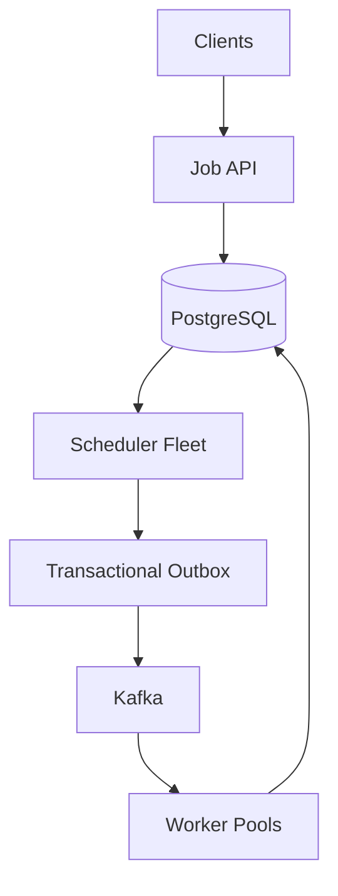

# Mock 07 — Distributed Job Scheduler (Attempt 01)

**Date:** 2026-10-08  
**Type:** HLD  
**Evaluator:** ChatGPT  
**Result:** Unscored — the session was completed, but no evidence-based scorecard was recorded  
**Status:** Mock stopped during the retry and DLQ discussion  
**Revision guide:** [Distributed Job Scheduler — HLD Revision Pack](../../hld/distributed-job-scheduler.md)  
**Suggested re-attempt:** 2026-10-18

## Problem statement

Design a distributed job scheduler that supports immediate, future and recurring jobs. It should execute millions of jobs reliably across horizontally scaled scheduler and worker instances while supporting retries, cancellation, execution history and failure recovery.

## Preserved attempt evidence

The following requirements and assumptions were recorded during the mock:

- Support one-time and recurring jobs.
- Approximately 20 million jobs per day.
- Plan for about 5,000 scheduled executions per second at peak.
- Target execution accuracy of approximately ±2 seconds under supported load.
- Scale the scheduler and worker fleets horizontally.
- Use at-least-once execution rather than claiming global exactly-once execution.
- The discussion reached retry and dead-letter handling before the mock was stopped.

The complete word-for-word candidate transcript and a five-category score were not preserved. This attempt is therefore intentionally marked **Unscored** instead of inventing a result.

## Design recorded after the mock

The detailed corrected design is maintained in the [revision pack](../../hld/distributed-job-scheduler.md). Its central decisions are:

1. PostgreSQL is the durable source of truth for job definitions, runs and state transitions.
2. Far-future jobs remain in PostgreSQL; schedulers load only a near-term sliding window.
3. Multiple scheduler nodes claim different due rows using transactions and `FOR UPDATE SKIP LOCKED`.
4. Claiming a run and inserting a `JOB_READY` outbox event happen in one transaction.
5. An outbox publisher delivers ready events to Kafka using at-least-once publication.
6. Workers use a stable execution ID and idempotent business operations.
7. Business state is committed before the Kafka offset is committed.
8. Long-running jobs use renewable leases so abandoned runs can be recovered.
9. Recurring jobs define overlap and misfire policies explicitly.
10. Retries use durable scheduling, exponential backoff and jitter; exhausted jobs go to a DLQ.
11. Kafka buffers bursts, while priorities, quotas and backpressure protect workers and downstream services.

## Core architecture



Redis may be used for caching, heartbeats or a near-term sorted set, but losing Redis must not lose scheduled jobs.

## Critical flow

1. A client creates a job through the Job API.
2. The Job Service validates the schedule and stores the job in PostgreSQL.
3. A scheduler selects a batch of due rows using `FOR UPDATE SKIP LOCKED`.
4. In one transaction, it creates/claims the job run and writes a `JOB_READY` outbox event.
5. An outbox publisher sends the event to Kafka.
6. A worker consumes the execution ID and performs the operation idempotently.
7. The worker commits business state and job status before committing the Kafka offset.
8. A crash before offset commit causes redelivery, but idempotency prevents duplicate side effects.

## Important correction: DB and Kafka consistency

The scheduler must not update PostgreSQL and publish directly to Kafka as two unrelated operations. If the database commit succeeds and Kafka publishing fails, the job can become stuck or lost.

Use a transactional outbox:

```text
BEGIN
  claim/create job run
  insert JOB_READY outbox row
COMMIT
```

The relay may publish the same event twice if it crashes after publishing but before marking the outbox row as published. This is why workers still need stable execution IDs and idempotency.

## Important correction: exactly-once wording

The system provides:

```text
at-least-once delivery
+ idempotent worker/business operation
= effectively-once business outcome where possible
```

It cannot generally guarantee exactly-once execution across Kafka, a database and arbitrary external side effects.

## Retry and DLQ answer that was missing at the stopping point

### Retry classification

- Retry transient errors such as timeout, temporary database failure or HTTP `429`/`503`.
- Do not automatically retry permanent errors such as invalid payload or unsupported job type.
- Use exponential backoff with jitter to avoid synchronized retry storms.

Example:

```text
1 second -> 5 seconds -> 30 seconds -> 2 minutes -> 10 minutes
```

### Durable retry flow

```text
RUNNING
  -> retryable failure
  -> RETRY_SCHEDULED with next_retry_at
  -> retry dispatcher
  -> Kafka
  -> next attempt
```

Do not keep delayed retries only in worker memory. A restart would lose them.

### DLQ flow

After the maximum number of attempts, or for a non-retryable poison job:

```text
RUNNING -> FAILED_PERMANENTLY -> DLQ
```

The DLQ record should contain the job ID, run ID, payload reference, attempt count, last error and failure timestamps. Replay must reuse the same business idempotency protection and create a controlled new attempt rather than bypassing state checks.

### Retry-storm protection

- Exponential backoff with jitter.
- Circuit breaker for an unhealthy dependency.
- Global and per-destination concurrency limits.
- Rate-limited retries.
- Pause/resume controls for a failing job type.
- Alerts on retry volume, oldest retry and DLQ growth.

## Failure scenarios to practise

| Failure | Expected behaviour |
|---|---|
| Scheduler crashes before claim transaction commits | Transaction rolls back; another scheduler can claim the job |
| Scheduler crashes after outbox commit | Another outbox publisher publishes the durable event |
| Kafka is unavailable | Outbox backlog grows safely; alert and retry |
| Worker crashes before business commit | Kafka redelivers the event |
| Worker crashes after business commit but before offset commit | Kafka redelivers; idempotency prevents duplicate effect |
| Worker dies during a long job | Lease expires; another worker can recover the run |
| Scheduler fleet is down | Jobs remain in PostgreSQL; misfire policy handles overdue occurrences |
| Redis is unavailable | Core scheduling continues because Redis is not authoritative |

## Unresolved evaluation gaps

1. Retry classification, durable backoff and DLQ replay were not completed during the live mock.
2. The full original transcript was not saved, so communication and time-management cannot be scored fairly.
3. The design should be re-attempted without the revision guide to verify recall of outbox, idempotency, leases and burst handling.

## Corrective exercises

1. Explain the architecture in four minutes without notes.
2. Explain `FOR UPDATE SKIP LOCKED` and the outbox crash cases in three minutes.
3. Walk through a worker crash after the side effect but before Kafka offset commit.
4. Design retry, jitter, circuit breaker and DLQ replay in five minutes.
5. Explain why one million jobs scheduled at the same second cannot all meet a ±2-second SLA at 5,000 executions/sec.

## Two-minute interview summary

> PostgreSQL is the source of truth for job definitions and runs. Far-future jobs remain in the database, while multiple schedulers load a small sliding window and claim due jobs using transactions and `FOR UPDATE SKIP LOCKED`. Claiming a run and writing its outbox event happen atomically. Outbox publishers send events to Kafka, which buffers bursts and distributes work to horizontally scaled workers. Execution is at least once, so each run has a stable execution ID and workers make business operations idempotent. Long-running jobs use leases, retries use durable exponential backoff with jitter, and permanently failing jobs move to a controlled DLQ. Overlap, misfire and cancellation policies are explicit, and PostgreSQL remains authoritative if scheduler memory or Redis is lost.

## Re-attempt goal

Complete a 45–60 minute design without hints and finish the retry/DLQ, burst, cancellation and worker-crash follow-ups. Add a score only after that attempt provides enough observable evidence.
