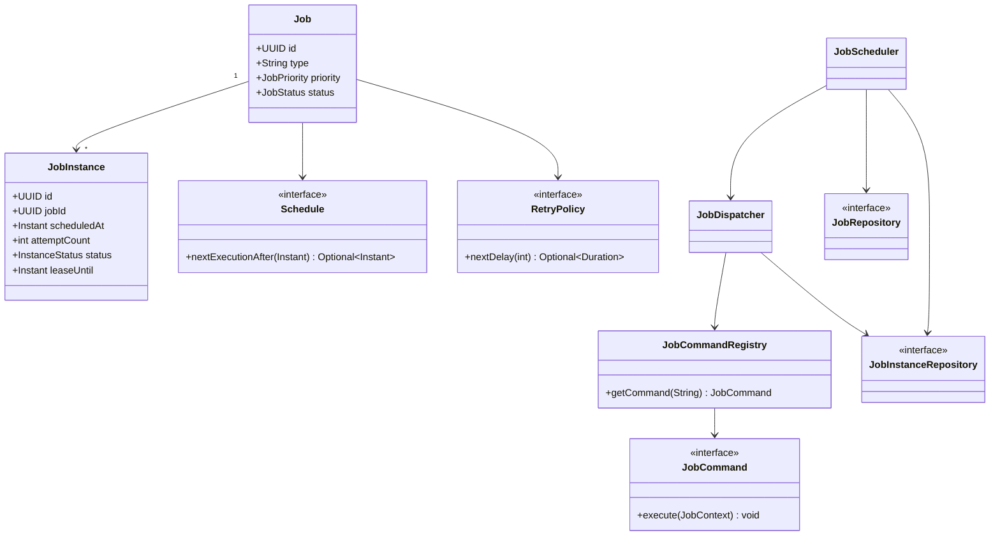

# LLD Mock — Distributed Job Scheduler (Attempt 01)

**Date:** 2026-10-10  
**Role:** Schrödinger Senior Software Developer (Backend)  
**Language:** Java 21 / Spring Boot examples  
**Format:** Guided question-by-question mock; not a timed, unaided implementation  
**Result:** **7.8/10** (equal-weight mean of eight assessed sections; cancellation was supplied as a reference answer, not independently scored)  
**Status:** Learning — next step: independently code the critical flow and retry the mock.

> This file separates what was demonstrated in the mock from the interviewer-provided reference design. The score measures performance during guided practice, not predicted interview success.

## 1. Scorecard

| Section | Score /10 | Evidence / feedback |
|---|---:|---|
| Requirements | 8 | One-time, cron, priority, retry, cancellation, status, multi-worker, misfires, extensibility; needed overlap/cancellation/durability clarifications |
| Class design | 7.5 | Job vs JobInstance, Command, Scheduler, WorkerPool, Redis lock, RetryPolicy; missing repositories/strategy separation initially |
| Java interfaces / patterns | 6.5 | Correct Command/Strategy/Registry purposes, but requested code was not supplied independently |
| Concurrency | 8 | PriorityBlockingQueue and atomic DB UPDATE conditional on PENDING; needed delayed scheduling/cancel-race details |
| Retry implementation | 8 | Durable nextRetryAt, nonblocking worker, three attempts, exponential backoff; needed attempt ownership and claim lease |
| Graceful shutdown | 8 | Stop poll, drain, shutdown/await; needed cooperative interruption, no unsafe reset of running work |
| SOLID principles | 7 | Correct definitions; needed examples tied to JobScheduler classes |
| Bulkhead / resource isolation | 9 | Separate bounded fast/slow/critical pools, custom rejection and durable deferral; differentiate dispatch deferral from business retry |
| Cancellation / reschedule race | Not scored | User requested reference answer rather than providing an implementation |

**Overall assessed mean:** (8 + 7.5 + 6.5 + 8 + 8 + 8 + 7 + 9) / 8 = **7.75 → 7.8/10**.

## 2. Problem statement and scope

Design an extensible, reliable low-level Job Scheduler:

- One-time and cron jobs; later add fixed-delay.
- Distinct job types: email, cleanup, reporting.
- HIGH / MEDIUM / LOW priority when multiple jobs are due.
- Max 3 total attempts, exponential backoff.
- Cancel a scheduled job; best-effort cancellation once RUNNING.
- Query status; survive restart.
- Distributed worker machines and atomic ownership.
- Misfires: catch up or skip.
- 5–10K executions/minute; avoid duplicate concurrent ownership.
- Show SOLID, command/strategy/registry patterns, class responsibilities, Java concurrency and lifecycle.

This is **LLD**: assume storage and worker infrastructure; do not spend the round drawing Kafka brokers or shards unless asked.

## 3. Main classes and responsibilities

| Type | Responsibility |
|---|---|
| `Job` | Durable definition: job ID, type, priority, payload reference, schedule, retry policy, status |
| `JobInstance` | One scheduled occurrence: run ID, job ID, scheduledAt, attemptCount, execution state, lease/owner, timestamps |
| `JobCommand` | Extensible execution behavior, `execute(JobContext)` |
| `Schedule` | Compute upcoming run time; implementations OneTime, Cron, FixedDelay |
| `RetryPolicy` | Compute next delay or terminate retries; ExponentialBackoff, FixedDelay, NoRetry |
| `JobCommandRegistry` | Resolve registered commands by job type |
| `JobScheduler` | Find due occurrences, coordinate scheduling and dispatch; not execute business logic |
| `JobDispatcher` | Route due instances to appropriate bounded worker pools |
| `JobRepository` | Job definition persistence |
| `JobInstanceRepository` | Atomic claims, completion, retry persistence, cancellation, lease management |
| `WorkerPool` | Run commands using bounded executors |
| `CancellationToken` | Cooperative cancellation for running operations |

### Class relationships



## 4. Core Java contracts (revision reference, not code written independently during mock)

```java
public interface JobCommand {
    void execute(JobContext context) throws Exception;
}

public interface Schedule {
    Optional<Instant> nextExecutionAfter(Instant time);
}

public interface RetryPolicy {
    // failedAttempt is 1-based (attempt 1 already failed).
    Optional<Duration> nextDelay(int failedAttempt);
}

public interface JobInstanceRepository {
    List<JobInstance> claimDueJobs(Instant now, int batchSize);
    boolean markRunning(UUID instanceId, UUID workerId, long token);
    boolean markCompleted(UUID instanceId, UUID workerId, long token);
    boolean scheduleRetry(UUID instanceId, UUID workerId, long token,
                          Instant nextRetryAt);
    boolean cancelIfNotRunning(UUID instanceId);
}
```

### Command + Registry

```java
public final class JobCommandRegistry {
    private final Map<String, JobCommand> commands;

    public JobCommandRegistry(Map<String, JobCommand> commands) {
        this.commands = Map.copyOf(commands);
    }

    public JobCommand getCommand(String type) {
        JobCommand command = commands.get(type);
        if (command == null) throw new IllegalArgumentException("Unknown job type: " + type);
        return command;
    }
}
```

For Spring, register `@Component("EMAIL")`, `@Component("CLEANUP")`, etc., and inject the bean map. No arbitrary user-provided class names should be loaded.

### Patterns and SOLID

- **Command:** `JobCommand` hides per-job business behavior.
- **Strategy:** `Schedule` and `RetryPolicy` let new algorithms be added.
- **Registry/Factory:** job type maps to command.
- **Repository:** persistence abstracted from scheduling.
- **Bulkhead:** separate worker pools for fast, slow, critical jobs.
- **SRP:** scheduler schedules; command executes; repository persists; policy calculates retry.
- **OCP:** add `FixedDelaySchedule` or `ExportJob` without rewriting scheduler/worker.
- **DIP:** scheduler depends on `JobRepository`/`JobDispatcher`, not concrete PostgreSQL/executor types.
- **ISP/LSP:** narrow interfaces; every schedule implementation honors the same next-execution contract.

**Nuance:** fixed-delay recurrence computes the next run from previous completion, while cron uses calendar time. The scheduling contract needs adequate context rather than assuming all strategies calculate from identical starting points.

## 5. Execution state machine

```text
PENDING -> CLAIMED -> RUNNING -> COMPLETED
                        |
                        +-> RETRY_SCHEDULED -> CLAIMED -> RUNNING
                        |
                        +-> FAILED

PENDING / unstarted CLAIMED -> CANCELLED
RUNNING -> best-effort cooperative cancellation (policy-defined outcome)
```

Parent `Job` controls recurring definition status: ACTIVE / PAUSED / CANCELLED. Each `JobInstance` has its independent state. Use unique `(job_id, scheduled_at)` or an occurrence key to avoid duplicate recurring-instance generation.

### Scheduler queue and distributed claim

- `PriorityBlockingQueue` is thread-safe **but not time-aware**: `take()` may return tomorrow’s job immediately.
- Consider `DelayQueue<DelayedJob>` for due-time gating, plus deterministic priority tie-breaking when times match; durable DB is authoritative.
- Concurrent rescheduling requires remove/reinsert or versioned stale-entry detection; mutating an object inside a heap does not reorder it.
- Atomic DB claims prevent different machines from both winning the same state transition:

```sql
UPDATE job_instances
SET status = 'CLAIMED',
    worker_id = :workerId,
    lease_until = :leaseUntil,
    execution_token = execution_token + 1
WHERE id = :instanceId AND status = 'PENDING';
```

Only the caller observing one updated row owns the claim. Due-job fetch across scheduler nodes may use `SELECT ... FOR UPDATE SKIP LOCKED` with short transactions.

**Key caveat:** a claimed job can outlive its lease after a GC pause. Use token/version checks for state changes; use idempotency or downstream fencing for side effects.

## 6. Retry design — user answer and corrections

The user correctly designed a `RetryPolicy` with exponential delay, `JobWorker` that persists `RETRY_SCHEDULED`, and `JobScheduler` that polls the DB for due retries every ~500 ms. No `Thread.sleep()`; retries survive restart.

Establish unambiguous attempt semantics: `attemptCount` = number of executions **started**, incremented atomically when a worker starts; never also increment in the catch block.

| Started attempt | Failure action |
|---|---|
| 1 | schedule retry in 1 second |
| 2 | schedule retry in 2 seconds |
| 3 | mark FAILED |

```java
public final class ExponentialBackoffPolicy implements RetryPolicy {
    private final int maxAttempts;
    private final Duration initial;

    public ExponentialBackoffPolicy(int maxAttempts, Duration initial) {
        this.maxAttempts = maxAttempts;
        this.initial = initial;
    }

    @Override
    public Optional<Duration> nextDelay(int failedAttempt) {
        if (failedAttempt >= maxAttempts) return Optional.empty();
        return Optional.of(initial.multipliedBy(1L << (failedAttempt - 1)));
    }
}
```

Use `Instant` for persistence, cap backoff, add jitter and classify retryable versus permanent errors. Persist retry state conditionally on worker ownership/token. A scheduler crash after DB claim but before in-memory enqueue requires leases and reclamation.

## 7. Cancellation and rescheduling race (reference answer supplied during mock, unscored)

Cancellation must atomically win over the `CLAIMED -> RUNNING` transition.

```sql
UPDATE job_instances
SET status = 'CANCELLED', version = version + 1
WHERE id = :instanceId AND status IN ('PENDING', 'CLAIMED');
```

Worker immediately before business logic:

```sql
UPDATE job_instances
SET status = 'RUNNING', version = version + 1
WHERE id = :instanceId AND status = 'CLAIMED'
  AND worker_id = :workerId;
```

If cancellation wins, worker sees zero rows and must not start. If RUNNING wins, cancellation is best-effort (cooperative token/checkpoint). A status transition alone cannot atomically prevent an already-started **external** side effect.

Reschedule:

```sql
UPDATE job_instances
SET scheduled_at = :newTime, version = version + 1
WHERE id = :instanceId AND status = 'PENDING'
  AND version = :expectedVersion;
```

Queued snapshots carry the old version and are rejected if stale. Repeated cancel is idempotent.

## 8. Graceful shutdown — user answer and corrections

Original answer: stop DB polling, drain `PriorityBlockingQueue`, return unstarted jobs to `PENDING`, call `ExecutorService.shutdown()`, await ~30s, then `shutdownNow()`, recover zombies via heartbeat.

Corrections:

1. Mark instance **DRAINING** and stop BOTH polling and dispatch before draining.
2. Release claims only for tasks provably not started. Do **not** blindly reset RUNNING to PENDING: side effects may already have occurred.
3. `shutdownNow()` is a cooperative interrupt request, not forced thread termination.
4. Finish/persist completed work within grace period; recover others via persisted leases and idempotency.
5. Shutdown should be idempotent; K8s readiness/termination grace should coordinate draining.

```java
if (!shuttingDown.compareAndSet(false, true)) return;
schedulerPool.shutdown(); // also stop queue dispatcher
workerPool.shutdown();
try {
    if (!workerPool.awaitTermination(30, TimeUnit.SECONDS)) {
        workerPool.shutdownNow();
    }
} catch (InterruptedException e) {
    workerPool.shutdownNow();
    Thread.currentThread().interrupt();
}
// Recovery coordinator reclaims expired persisted leases later.
```

## 9. Bulkhead / bounded executors — strongest answer (9/10)

The user proposed separate dedicated pools for slow, fast and high-priority jobs, each with bounded queue capacity and custom rejection; rejected unstarted jobs should be durably deferred rather than silently lost.

```text
                 Scheduler
                     |
                 Dispatcher
            /--------|---------\
         FAST       SLOW      CRITICAL
         pool       pool        pool
       bounded    bounded     bounded
```

**Important improvements:**
- Do not use `CallerRunsPolicy` on a scheduler dispatch thread if slow jobs could block scheduling.
- On rejected submission, atomically release the claim or mark deferred using token checks, without incrementing the business execution attempt.
- Prioritize based on due time, job criticality and fairness; guard against starvation.
- Pool sizes are workload-dependent; hard-coded counts are merely illustrative.
- Monitor queue depth, active threads, rejection counts, execution latency and oldest waiting job.

## 10. Critical edge-case matrix

| Scenario | Mitigation |
|---|---|
| Same run claimed twice | Atomic conditional claim / `SKIP LOCKED` |
| Claimed, process crashes before enqueue | Expiring lease and recovery |
| Worker crashes after external effect | Business idempotency key, durable dedup |
| Old worker resumes after lease expiry | Fencing/ownership token; downstream idempotency |
| Duplicate cron instance created | Unique occurrence key |
| Job scheduled far in future | DB authoritative; only near-term queue in memory |
| Same due instant, different priority | Priority tie-break after due-time eligibility |
| Rescheduled entry remains in queue | Version check, drop stale snapshot |
| Cancel races with RUNNING | Atomic status competition, best-effort after start |
| Retry occurs on restart | Persist `nextRetryAt` |
| Three failures | Final FAILED; optional DLQ/audit record |
| Slow task starves fast jobs | Bulkhead / bounded pools |
| All pools saturated | Admission control, durable deferral, alert |
| Grace period expires | Interrupt cooperative work, recover via lease |
| Lost scheduler or Redis state | DB source of truth; reload |
| Recurrence overlaps | ALLOW, SKIP, QUEUE configurable |
| Downtime misses occurrences | Misfire: run all, latest, or skip |
| DST/clock shift | Store UTC instants + IANA timezone for cron |
| Priority starvation | Aging / reserved capacity / weighted fairness |
| DB write fails after side effect | Idempotent retried business operation |
| Very large queue | Bounded admission and durable backlog |

## 11. Interview pacing — 45–60 min

- **0–5:** clarify one-time/cron, priority, retries, cancellation, durability, overlap and scale.
- **5–15:** Job vs JobInstance, lifecycle, responsibilities.
- **15–25:** Schedule/RetryPolicy/JobCommand/Registry, repository/dispatcher relations.
- **25–40:** implement atomic claim, due dispatch and non-blocking durable retry.
- **40–50:** cancellation/reschedule race, lease recovery, graceful shutdown.
- **50–60:** bulkheads, bounded queues, failure scenarios and trade-offs.

### Two-minute interview pitch

> I separate durable job definitions from individual execution instances. Job defines schedule, job type, priority and retry policy, and JobInstance tracks each occurrence and its attempt/state. Command handles executable job logic; Strategy handles cron/one-time schedules and retry policies; a registry resolves job types without changing the scheduler.
>
> The scheduler queries durable storage for due work and uses atomic state transitions to claim executions. Workers execute through bounded pools; leases and execution tokens handle crashes and stale owners, while idempotent business operations protect against repeated side effects. Retries persist nextRetryAt rather than sleeping in a worker thread. Cancellation races are resolved with conditional status updates and version checks.
>
> For production readiness I drain scheduling and workers gracefully, recover expired leases, and isolate slow from critical jobs with the Bulkhead Pattern. This follows SRP, OCP and DIP and remains extensible.

## 12. Next actions

1. **Unaided coding:** Implement `JobScheduler`, `JobDispatcher`, `RetryPolicy`, `JobInstanceRepository` interface and job claiming/retry flow in Java without seeing reference code.
2. **Race tests:** cancellation vs RUNNING, reschedule vs dispatch, lease expiry/stale worker, simultaneous claims, attempt-3 terminal failure.
3. **Timed LLD re-attempt:** one 45–60 min dry run without hints; update score based on actual code and trade-offs.
4. **Alternate LLD:** Parking Lot or Notification Framework with concrete Java class relationships and implementation.


---

## 13. Detailed mock transcript — YOUR ANSWER vs INTERVIEWER IMPROVEMENT

**Authenticity note:** Quotations below are the user's actual wording/code from the mock wherever available, with markdown/whitespace normalization. Reference answers, missed scenarios and expanded code are **interviewer-provided**, not claimed as independently solved. Existing sections 1–12 above remain the consolidated technical study guide.

### Q1. Functional and non-functional requirements — 8/10

**Your answer (original):**

> **Functional Requirements**
> - Schedule a one-time job to run at a specific time
> - Schedule a recurring job using a cron expression (e.g., every 5 minutes)
> - Jobs have a priority — higher priority jobs run first when multiple are due simultaneously
> - Failed jobs retry with exponential backoff (max 3 attempts)
> - Cancel a scheduled job
> - View job status: PENDING, RUNNING, SUCCESS, FAILED, CANCELLED
> - Workers are distributed — multiple machines can pick up jobs
>
> **Non-Functional Requirements**
> - No two workers must execute the same job instance simultaneously
> - Missed jobs (scheduler was down) must be caught up or skipped based on policy
> - Adding a new job type must not change the scheduler core (Open closed Principle )
> - Scheduler must handle 5k to 10k jobs per minute

**What to improve:** Clarify parent job vs occurrence, cancellation of running jobs, overlap policies, durability, time zones and what priority means for due tasks.

**Model follow-up:** “We need a durable Job definition and a separate JobInstance for each cron occurrence. Can cancellation affect RUNNING work? For overlap, should we ALLOW, SKIP or QUEUE? For downtime, apply explicit misfire policy.”

### Q2. Class responsibilities and relationships — 7.5/10

**Your answer (original content):**

> **Job** — id, name, type, priority, schedule (cron or one-time), retryConfig, status
>
> **JobInstance** — id, jobId, scheduledAt, startedAt, completedAt, attempt, status
>
> **JobCommand** — interface; execute() — Command pattern for job logic
>
> **JobScheduler** — main loop; picks next due job from priority queue
>
> **WorkerPool** — thread pool that executes job commands
>
> **DistributedLock** — ensures one worker per job instance (Redis SETNX)
>
> **RetryPolicy** — maxAttempts, backoffMultiplier
>
> **CronExpression** — parses cron string, computes next run time
>
> **Job:** id, name: String; cronExpression: String (null for one-time); nextRunTime: LocalDateTime; priority: int; retryPolicy; status: ACTIVE/PAUSED/CANCELLED; commandClass: String
>
> **JobInstance:** id, jobId; scheduledAt, startedAt, completedAt: LocalDateTime; attempt: int; status: PENDING/RUNNING/SUCCESS/FAILED; errorMessage
>
> **JobCommand:** execute(JobContext): void
>
> **RetryPolicy:** maxAttempts; initialDelaySeconds; backoffMultiplier
>
> **CronExpression:** getNextFireTime(from: LocalDateTime)
>
> **JobScheduler:** PriorityQueue<Job> ordered by nextRunTime and priority; start(); schedule(job); cancel(jobId)

**What to improve:** Introduce \`Schedule\` interface, \`JobRepository\`, \`JobInstanceRepository\`, \`JobDispatcher\`, \`JobCommandRegistry\`; use \`Instant\` for persisted execution time; avoid treating Redis SETNX as sufficient correctness; don't make arbitrary \`commandClass\` user-controllable. A heap must be reinserted/rebuilt on reschedule.

**Improved design:** See sections 3–5 for interfaces, diagram and state model.

### Q3. Command / Strategy / Registry — 6.5/10

**Your answer (verbatim):**

> **Command Pattern:** Encapsulates varying job execution steps behind a uniform \`execute()\` method.
>
> **Strategy Pattern:** Keeps scheduling algorithms flexible and decoupled from the job tasks themselves.
>
> **Registry Pattern:** Decouples creation logic, map-lookup routing eliminates the need to change code inside \`JobScheduler\` when adding a fourth or fifth job type later.

**What was missing:** Java code for runtime selection.

**Improved reference:**

\`\`\`java
interface JobCommand {
    void execute(JobContext context) throws Exception;
}

interface Schedule {
    Optional<Instant> nextExecutionAfter(Instant after);
}

interface RetryPolicy {
    Optional<Duration> nextDelay(int failedAttempt);
}

final class JobCommandRegistry {
    private final Map<String, JobCommand> commands;
    JobCommandRegistry(Map<String, JobCommand> commands) {
        this.commands = Map.copyOf(commands);
    }
    JobCommand get(String type) {
        JobCommand cmd = commands.get(type);
        if (cmd == null) throw new IllegalArgumentException("Unknown type: " + type);
        return cmd;
    }
}
\`\`\`

Spring \`@Component("EMAIL")\`, \`@Component("CLEANUP")\`, \`@Component("REPORT")\` implementations may be autowired as a map. Adding \`EXPORT\` does not require changing the dispatcher.

### Q4. Queue thread safety + distributed claim — 8/10

**Your answer (verbatim):**

> 1. **Producer Threads:** Call \`queue.add(job)\` or \`queue.remove(job)\` safely using the \`PriorityBlockingQueue\`.
> 2. **Scheduler Thread:** Polls the \`PriorityBlockingQueue\`. If a job's execution time has arrived, it hands the job to the 10-worker thread pool.
> 3. **Worker Thread:** Before running the actual business logic, the worker attempts an atomic database update (\`status = 'RUNNING' WHERE status = 'PENDING'\`).
> 4. **Execution:** Only the worker that gets a successful \`1-row updated\` confirmation from the database actually executes the job. The others gracefully exit.

**What to improve:** \`PriorityBlockingQueue.take()\` does not delay until a due timestamp; consider \`DelayQueue\` or polling with a deadline-aware loop. Prevent reschedule races with version checks. Atomic claim alone doesn't prevent duplicates after lease expiry and stale-worker resumption. Keep \`CLAIMED\` and \`RUNNING\` transitions distinct.

**Important query:**

\`\`\`sql
UPDATE job_instances
SET status = 'RUNNING', worker_id = :workerId
WHERE id = :id AND status = 'CLAIMED' AND worker_id = :workerId;
\`\`\`

Check exactly one updated row.

### Q5. Durable retry logic — 8/10

**Your original Java answer (reproduced, layout normalized):**

\`\`\`java
public enum JobStatus { PENDING, RUNNING, RETRY_SCHEDULED, COMPLETED, FAILED }

public class RetryPolicy {
    private static final int MAX_ATTEMPTS = 3;
    private static final long INITIAL_BACKOFF_SEC = 1;

    public boolean canRetry(JobInstance instance) {
        return instance.getAttemptCount() < MAX_ATTEMPTS;
    }

    public LocalDateTime calculateNextRetryTime(JobInstance instance) {
        // Attempt 1 failed -> backoff = 1 * 2^0 = 1 second
        // Attempt 2 failed -> backoff = 1 * 2^1 = 2 seconds
        long delayInSeconds = INITIAL_BACKOFF_SEC *
                (long) Math.pow(2, instance.getAttemptCount() - 1);
        return LocalDateTime.now().plusSeconds(delayInSeconds);
    }
}

public class JobWorker implements Runnable {
    private final JobInstance jobInstance;
    private final JobInstanceRepository repository;
    private final RetryPolicy retryPolicy;

    public JobWorker(JobInstance jobInstance, JobInstanceRepository repository,
                     RetryPolicy retryPolicy) {
        this.jobInstance = jobInstance;
        this.repository = repository;
        this.retryPolicy = retryPolicy;
    }

    @Override
    public void run() {
        try {
            executeJob(jobInstance);
            repository.updateStatus(jobInstance.getId(), JobStatus.COMPLETED);
        } catch (Exception e) {
            handleFailure(e);
        }
    }

    private void handleFailure(Exception e) {
        jobInstance.incrementAttemptCount();

        if (retryPolicy.canRetry(jobInstance)) {
            LocalDateTime nextRetryAt =
                    retryPolicy.calculateNextRetryTime(jobInstance);
            repository.updateForRetry(jobInstance.getId(),
                    JobStatus.RETRY_SCHEDULED,
                    jobInstance.getAttemptCount(), nextRetryAt);
        } else {
            repository.updateStatus(jobInstance.getId(), JobStatus.FAILED);
        }
    }

    private void executeJob(JobInstance job) {
        /* Actual job execution logic */
    }
}

public class JobScheduler {
    private final JobInstanceRepository repository;
    private final PriorityBlockingQueue<JobInstance> queue;
    private final ScheduledExecutorService pollingExecutor =
            Executors.newSingleThreadScheduledExecutor();

    public JobScheduler(JobInstanceRepository repository,
                        PriorityBlockingQueue<JobInstance> queue) {
        this.repository = repository;
        this.queue = queue;
    }

    public void start() {
        pollingExecutor.scheduleWithFixedDelay(
                this::loadDueJobsIntoQueue, 0, 500, TimeUnit.MILLISECONDS);
    }

    private void loadDueJobsIntoQueue() {
        List<JobInstance> dueJobs =
                repository.findAndClaimDueJobs(LocalDateTime.now());
        for (JobInstance job : dueJobs) {
            queue.add(job);
        }
    }
}
\`\`\`

**Your explanation (original):**

> **Max 3 total attempts:** Controlled cleanly via \`retryPolicy.canRetry()\` tracking the \`attemptCount\`.
>
> **Exponential backoff:** Handled by \`2^(attemptCount-1)\`, producing exactly a 1-second delay after the first failure, and a 2-second delay after the second failure.
>
> **Non-blocking:** The worker thread writes the metadata to the database and exits its \`run()\` loop immediately. No thread sleeps or holds state in active memory.
>
> **Survival across restarts:** If the system crashes at second 1.5 of a 2-second backoff, the application reboots, the \`JobScheduler\` queries the database, detects that \`nextRetryAt\` is now in the past, and safely queues it up again.

**Corrections:** Your logic is strong, but choose and document one attempt-count convention (increment on start, not again in catch); use \`Instant\`; make retry policy configurable; add jitter and retryable-error classification; handle crash between DB claim and queue submission using a lease; include dispatcher consumption, as queue insertion alone doesn't execute a job.

### Q6. Cancellation and reschedule race — **not independently attempted**

**Actual response:** “Can you add this answer”

**Reference answer (interviewer-supplied):** Have cancellation and \`CLAIMED -> RUNNING\` compete using atomic DB updates, checking affected rows. PENDING/CLAIMED can be cancelled if not started; RUNNING uses cooperative cancellation. Reschedule with \`version\` and reject stale queued snapshots.

\`\`\`sql
UPDATE job_instances SET status='CANCELLED', version=version+1
WHERE id=:id AND status IN ('PENDING', 'CLAIMED');

UPDATE job_instances SET status='RUNNING', version=version+1
WHERE id=:id AND status='CLAIMED' AND worker_id=:workerId;
\`\`\`

**Missing interview nuance:** Once an external side effect is underway, a DB status update cannot un-send a network request. Make the cancellation SLA explicit. Repeated cancel should be idempotent.

### Q7. Graceful shutdown — 8/10

**Your answer (verbatim):**

> To achieve a graceful shutdown without data loss, the scheduler must first stop polling the database to prevent accepting new work into memory. Next, the in-memory \`PriorityBlockingQueue\` is drained completely, and those unstarted jobs are atomically updated back to \`PENDING\` in the database. The worker thread pool is then closed using \`ExecutorService.shutdown()\`, which permits currently executing jobs to finish naturally within a designated grace period (e.g., 30 seconds). Any job exceeding this window is forcefully interrupted via \`shutdownNow()\`, triggering internal try-catch blocks that revert the job's database status back to \`PENDING\` for future recovery. Finally, an independent database heartbeat mechanism acts as a fail-safe, reclaiming any "zombie" jobs left in a \`RUNNING\` state if a server crashes instantly before the shutdown sequence can complete.

**What to improve:** Mark DRAINING; stop both polling **and dispatching**; release only proven-unstarted claims; do not automatically reset RUNNING to PENDING; \`shutdownNow()\` is cooperative interruption and cannot forcibly kill Java threads. Lease recovery + idempotency protect uncertain outcomes. See section 8.

### Q8. SRP / OCP / DIP — 7/10

**Your answer (verbatim):**

> Single Responsibility - I will make sure that each class responsible for single business requirement it should not handle more than one feature for code readability and maintainability
>
> Open/Closed - Our classes implementation should be closed for modification but open for extension
>
> and Dependency Inversion - We should also make sure that higher level class does not communicate with low level classes or concrete class it should talk via abstarction or interface so that we can achieve the loose coupling in our design

**What to improve:** Apply each definition to concrete classes:
- SRP: \`JobScheduler\` schedules, \`JobCommand\` executes, \`RetryPolicy\` calculates, \`JobInstanceRepository\` persists.
- OCP: add \`CronSchedule\`, \`FixedDelaySchedule\`, new \`JobCommand\` without rewriting scheduler.
- DIP: inject abstractions \`JobInstanceRepository\` and \`JobDispatcher\` rather than \`new PostgresRepository()\`.

### Q9. Bulkhead + bounded pools — 9/10

**Your answer (verbatim):**

> To prevent a single slow job type from paralyzing the scheduler, you should apply the **Bulkhead Pattern** by isolating execution resources into distinct, dedicated thread pools based on job profiles or types. Under this design, standard fast jobs route to a primary pool while slow-running tasks are confined to an isolated secondary pool, ensuring that a traffic surge in slow tasks never starves critical high-priority work. This secondary pool must use a **bounded queue** to strictly limit memory consumption and prevent an infinite backlog of slow jobs from triggering an application crash. When this bounded queue reaches maximum capacity, a custom **rejection policy** takes effect rather than blocking the main scheduler thread. Instead of dropping the rejected job permanently, the handler updates its state back to \`PENDING\` in the database with an added backoff delay, gracefully shedding runtime execution pressure back onto the persistence layer until the system recovers.

**What to improve:** Never use scheduler-thread \`CallerRunsPolicy\` for potentially slow work; use bounded separate pools, admission control and durable deferral with owner/token validation. Rejection before business execution should not consume one of the three business attempts. Prevent starvation of low-priority work.

---

## 14. Missing interviewer questions and model answers — supplemental, **not scored**

These are extra questions that a senior LLD interviewer could ask. They were **not answered independently in this mock**.

### M1. How does recurring job creation avoid duplicates?

Define a stable occurrence key \`(job_id, scheduled_at)\` or \`(job_id, occurrence_id)\` with a DB unique constraint; create occurrence atomically, increment the schedule cursor in the same transaction, and use a misfire policy on recovery. For fixed-delay, compute the next due time from prior completion, not the previous scheduled time.

### M2. How do you implement cron timezone and DST handling?

Store the IANA zone such as \`Asia/Kolkata\` plus cron expression, calculate next calendar occurrence using a tested parser, and persist actual due instants in UTC as \`Instant\`. Explicitly define behavior for nonexistent or repeated local times at DST changes. Use \`Clock\` injection for deterministic tests.

### M3. What happens if a task has succeeded externally but DB completion write fails?

Execution may be retried; give the external operation a stable idempotency key (for example \`jobRunId\`), persist deduplication at the business destination where possible, and reconcile uncertain results. Do not claim a DB status flag alone prevents duplicate external effects.

### M4. What if a lease expires while a worker is still alive?

A replacement worker can claim the run while the old worker resumes. Require owner/token checks on status updates, heartbeat renewal only for current owner, and downstream fencing where supported. Otherwise use idempotency and treat overlapping execution as a possibility, not an impossibility.

### M5. How do you test time-based scheduling and concurrency?

Inject \`Clock\`; use fake repositories and deterministic scheduled-time fixtures. Test attempt 1→retry 1s, attempt 2→retry 2s, attempt 3→FAILED; cron misfires; equal-time priority; duplicate concurrent claims; cancel vs start; stale reschedule version; interrupted shutdown; orphaned lease; queue saturation. Use real integration tests for DB conditional update semantics rather than only mocks.

### M6. What happens when the database is down?

Never acknowledge a durable schedule before persistence succeeds. Reject/return retriable errors for new writes; pause claims/dispatch if state cannot be authoritatively checked; retry with bounded backoff and restore operation after DB recovery. Avoid unbounded local queues as a substitute for durable storage.

### M7. How would you prevent a large tenant from monopolizing the scheduler?

Per-tenant quotas/concurrency limits; bounded worker pools by workload class; fair scheduling (weighted round-robin or aging); metric/alert on waiting age and rejected/deferred dispatches; isolation to protect critical jobs.

### M8. How do you stop accidental memory growth?

Use bounded executor queues and controlled DB batch sizes; no eager loading of all future jobs. Treat in-memory queue as disposable optimization. Monitor active threads, queue length, heap, dispatch rate, retries and oldest pending age.

### M9. How do you handle a job that hangs indefinitely?

Persist timeout policy, set network I/O timeouts, cooperative cancellation or interruption, heartbeat/job lease and optionally checkpoint long work. Don't hold DB transaction across the whole command execution. After lease expiry, retry only with idempotent logic.

### M10. Why not use \`ScheduledExecutorService\` alone?

It is excellent for a single-process, non-durable lightweight scheduler. Here, restart safety, multi-machine claiming, retry persistence and audit history require a durable repository, ownership and recovery. A local scheduled executor can run polling, not replace persisted state.

### M11. What observability matters?

Measure schedule-to-start delay (accuracy SLO), queued/claimed age, per-type runtime, failures, retries, active threads, pool saturation, rejection/defer rate, expired leases and stuck RUNNING jobs. Propagate \`jobId\`, \`instanceId\` and \`traceId\` in structured logs and tracing.

### M12. What if cancel and reschedule happen together?

Make each state update conditional on expected \`version\` and current state; only one wins. Return a conflict or the authoritative final state to the losing request. Queue snapshots must carry and validate the version.

---

## 15. Seven-minute last-look checklist

1. **Separate Job from JobInstance** — one definition, many occurrences.
2. **Command + Strategy + Registry** — justify with a real Java interface.
3. **Database is durable; local queue is disposable** — \`PriorityBlockingQueue\` is not time-aware.
4. **Atomic claim** — only one row update wins; leases still necessary.
5. **Retry is nonblocking** — persist \`nextRetryAt\`; 1s, 2s then terminal FAILED.
6. **Cancel/reschedule race** — conditional transitions + versions; running cancellation is best-effort.
7. **Graceful shutdown** — DRAINING, stop dispatch, await, interrupt request, lease recovery.
8. **Bulkhead** — separate bounded executors, no silent loss, don't count saturation as a business attempt.
9. **Idempotency** — essential for crashes after external side effects.
10. **Communication** — explanation of class responsibility and a real code path beats pattern names alone.

**Next unassisted practice:** Implement due claim → dispatch → execution → retry and write the cancellation-versus-execution concurrency test in Java without consulting this reference.
